# Kurs i QGIS (3.x)

Forfatter: Anne B. Nilsen NIBIO og Peter Horvath NHM
sist oppdatert 20.05.2025
- [Kurs i QGIS (3.x)](#kurs-i-qgis-3x)
- [1. Bli kjent med QGIS-oppsettet](#1-bli-kjent-med-qgis-oppsettet)
    - [Prosjektinnstillinger](#prosjektinnstillinger)
    - [Andre innstillinger](#andre-innstillinger)
    - [Aktuelle CRS (EPSG)](#aktuelle-crs-epsg)
  - [Hente inn vektor og raster](#hente-inn-vektor-og-raster)
  - [Hent inn WMS- eller WFS-tjenester](#hent-inn-wms--eller-wfs-tjenester)
    - [Toporaster WMS](#toporaster-wms)
    - [AR50 WFS](#ar50-wfs)
    - [Norge i bilder](#norge-i-bilder)
- [2. Tilgang til geografisk informasjon (kartdata)](#2-tilgang-til-geografisk-informasjon-kartdata)
  - [Norge](#norge)
  - [Verden](#verden)
    - [Global Geospatial Data Portals](#global-geospatial-data-portals)
- [3. SOSI](#3-sosi)
- [4. Shape](#4-shape)
  - [Hente inn data uten projeksjon-informasjon](#hente-inn-data-uten-projeksjon-informasjon)
  - [Lage projeksjonsfil](#lage-projeksjonsfil)
  - [Lage ei ny shapefil](#lage-ei-ny-shapefil)
  - [Tegnsett](#tegnsett)
  - [Hente inn en csv-fil med koordinater](#hente-inn-en-csv-fil-med-koordinater)
  - [Lagre csv-fil som shapefil](#lagre-csv-fil-som-shapefil)
  - [Transformere ei shapefil fra et koordinatsystem til et annet](#transformere-ei-shapefil-fra-et-koordinatsystem-til-et-annet)
  - [Beregne koordinater, lengder og arealer](#beregne-koordinater-lengder-og-arealer)
    - [Koordinater](#koordinater)
    - [Lengder og areal](#lengder-og-areal)
      - [area($geometry)](#areageometry)
      - [$area](#area)
- [5. GeoPackage](#5-geopackage)
- [6. Plugins (programtillegg)](#6-plugins-programtillegg)
- [7. Digitalisering (kartlegging)](#7-digitalisering-kartlegging)
  - [Tilleggsinformasjon og GPS](#tilleggsinformasjon-og-gps)
  - [Tegn og registrer](#tegn-og-registrer)
  - [Tegneregler](#tegneregler)
  - [Områdeavgrensning](#områdeavgrensning)
  - [Sikre lovlig geometri og topologi](#sikre-lovlig-geometri-og-topologi)
  - [Digitaliseringstips](#digitaliseringstips)
  - [Feilsøk, korrigeringer og kontroll](#feilsøk-korrigeringer-og-kontroll)
  - [Topology Checker](#topology-checker)
- [8. Kartografi](#8-kartografi)
  - [Påskrift](#påskrift)
  - [Stiler (styles)](#stiler-styles)
  - [Show Map tips](#show-map-tips)
  - [Layout](#layout)
- [9. Hjelp](#9-hjelp)

# 1. Bli kjent med QGIS-oppsettet

Start QGIS. Ulike verktøy (ikoner), paneler og kartvindu vises. Utseende og hva som skal være tilgjengelig og synlig, samt størrelser og språk kan tilpasses egne ønsker og behov.

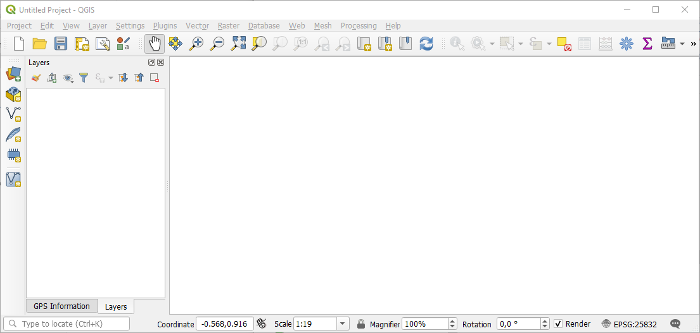

Høyreklikk i det grå feltet i toppmenyen for å slå av/på **paneler** og **verktøylinjer**.
**Verktøykassa** ligger under Prosessering på toppmenyen ```(Ctrl-Alt-T)```. Alle verktøy vises på høyre side. Flere verktøy: Settings – Options – Processing, slå på GDAL, GRASS m.fl.
Man kan søke etter funksjoner rett i søkefeltet i nedre venstre hjørne.  Tast inn ønsket ord.

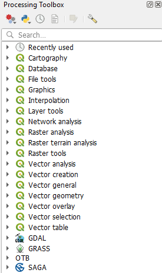  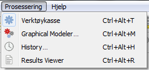

### Prosjektinnstillinger

Prosjekt – Prosjektegenskaper

Fane Generell:
Bruk relativ filsti.
Klikk OK og Apply.
Bytt ev. Selection- og/eller bakgrunnsfarge.
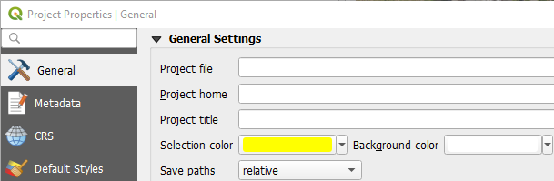

### Andre innstillinger

Etter endring klikk OK. Noen endringer krever omstart av QGIS for å tre i kraft.
Innstillinger – Innstillinger.

Fane Generelt:
Foretrekker QGIS på engelsk?
Endre lokalisering fra norsk til engelsk.

Gjør ev. ikoner og skrift større.


Fane CRS:
Ønsker et spesielt koordinat-system som default?
Hente en/få rasterfiler med CRS forskjellig fra prosjektet: Angi CRS for hver gang.
Hente mange rasterfiler: Påse derfor at prosjekt og rasterfiler har samme koordinatsystem og huk av for «Use project CRS», kap. 4.1.
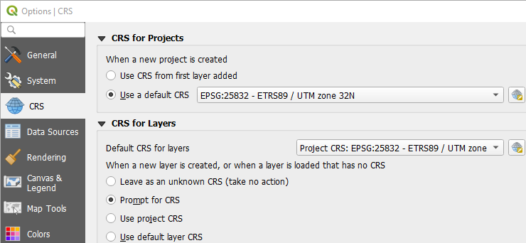

Fane Datakilder:
Ikke åpne egenskapstabellen i et dokkbart vindu – for visning av egenskapsverdier med  . Fjern NULL for «blank visning» for ikke satte egenskaps-verdier.


Fane Opptegning:
Ikke tegn opp kartlag når de legges inn. Smart ved store datasett hvor man bør zoome inn før opptegning.
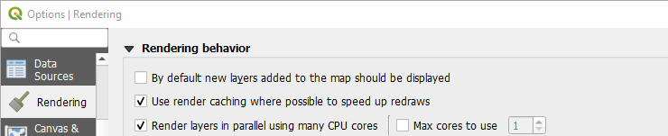

QGIS er naturlig å bruke når du skal se på

- **vektor**data (shapefiler)

- **raster**data (ortofoto, flybilder, satellittbilder)

- **WMS**- og **WFS**-tjenester

- og/eller skal gjøre **analyser** (få svar på spørsmål) eller hente ut nye datasett (nye shapefiler).

**Sett koordinatsystem** (CRS – Coordinate Reference System eller EPSG - The European Petroleum Survey Group).

(Finner en fin oversikt på <https://register.geonorge.no/register/epsg-koder>.)

### Aktuelle CRS (EPSG)

Projiserte koordinatsystem (EPSG, Beskrivelse)

- 25832 Euref 89, UTM-sone 32N (t.o.m. Trøndelag)
- 25833 Euref 89, UTM-sone 33N (Nordland og Troms)
- 25835 Euref 89, UTM-sone 35N (Finnmark)

Geografiske koordinatsystemer

- 4258 Euref 89 desimalgrader
- 4326 WGS84 desimalgrader

Liste med alle EPSG-koder («hva og hvor»): <http://spatialreference.org/ref/epsg/>.
[UTM-soner](https://no.wikipedia.org/wiki/UTM-koordinater#/media/Fil:Utm-zones.jpg) og [koordinater](https://no.wikipedia.org/wiki/UTM-koordinater).

## Hente inn vektor og raster

«Mange veier til Rom!»: ikonet Data Source Manager – Vector og naviger frem til ønsket fil eller, mye kjappere, klikk og dra shapefila direkte fra Filutforsker til QGIS-vinduet eller bruk Browser Panel. I Browser-panelet har man rask tilgang til disker, databaser, prosjektkatalogen. Man ser filtype (shape, raster, tabell) og geometritype (punkt, linje, polygon) vha. ikoner. Browser viser filer som kan dras inn i canvas. Se hvordan regskjema-katalogen vises i Browser vs. Filutforsker. Browser viser ulike geometrityper med samme symbol for shapefiler. For GeoPackage skilles geometritype.

  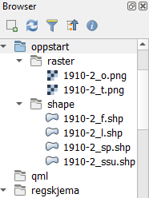 !

Hent inn shapefilene (UTM32 N) fra ```\01_oppstart\shape``` i Filutforsker. (Tips! Sorter på type.)
Vektorfilene inneholder informasjon om koordinatsystem i tilhørende prj-fil.

**Kartlagene** (shapfilene) legges inn i bestemt rekkefølge punkt, linje, polygon og får tildelt vilkårlige farger med unntak av shapefiler som har tilhørende stilfil (qml-fil med samme navn som shapefila).

**Panorer** kartet, **zoom** inn og ut, gå frem og tilbake mellom ulike zoom, zoom til kartlag, velge målestokk, skrive inn målestokk. Sette ulike farger, **endre lagsrekkefølgen** og fjerne et lag.

Endre symboler, farger, påskrift, kopier stiler og lagre stilfil for gjenbruk. Hvis *.shp og*.qml har samme navn og er lagret på samme sted, vil automatisk stilfilen brukes når man henter inn shapefila.

**Rasterfilene** inneholder ingen informasjon om koordinatsystem. Avhengig av hva man har valgt under fane CRS under Innstillinger, vil man bli spurt om koordinatsystem eller QGIS antar at rasterfilene har samme koordinatsystem som prosjektet.  Mer om dette i kap. 4.1.

Hent inn rasterfilene (UTM32 N) fra ```\01_oppstart\raster``` i Filutforsker. (Tips! Sorter på type.)

**Lagre prosjektet** (angi plassering og navn) ***.qgs** (en XML-fil om kartlagene og utseende i prosjektet).

## Hent inn WMS- eller WFS-tjenester

**WMS** (Web Map Service) er en tjeneste hvor en server på forespørsel kan sende kartutsnitt i form av rasterfiler tilbake til brukeren, enten direkte i nettleseren, en webapplikasjon eller en desktopapplikasjon (her QGIS).

Klikk ```Open Data Source Manager – WMS/WMTS```. Klikk Ny.

Angi et informativt valgfritt navn og URL (web-adressen). Men hva er adressen?

### Toporaster WMS

Gå til <www.geonorge.no>.
Søk etter topo, velg tjeneste og Topografisk Norgeskart gråtone.
Tjenesten inneholder topografiske kart i målestokken 1:500 til 1:10M, og N5 raster.

Kopier [URL-adressen](https://wms.geonorge.no/skwms1/wms.topograatone?service=wms&request=getcapabilities) under Distribusjon (rull ned) og lim den inn i WMS-vinduet i QGIS og klikk OK.


Velg lag og klikk Legg til. Pass på tegnerekkefølgen.Velger man topplaget (id 0), får man med alt.

Man kan i stedet velge et/flere bestemte lag.
Bare tegnforklaringen til sist valgte lag vises.
(Kan derfor lønne seg å gjenta innhentingen for et lag om gangen.)
Legg merke til at man av og til må zoome inn i kartet for at laget skal vises.

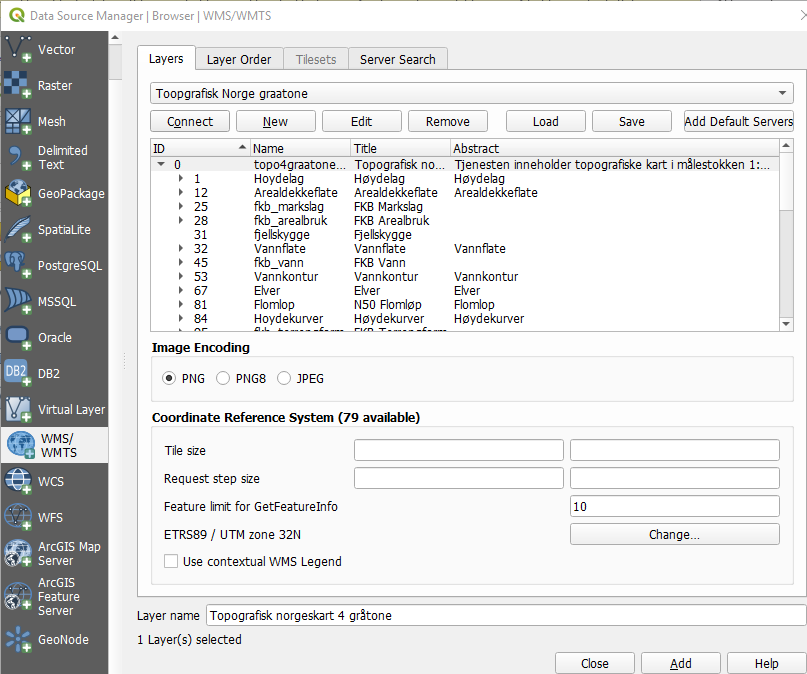
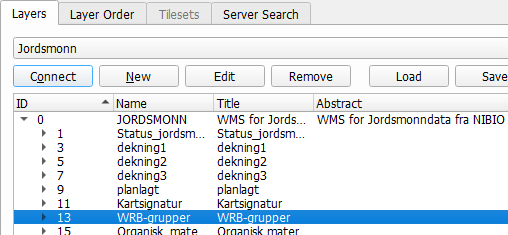

### AR50 WFS

Gå til [Geonorge](https://www.geonorge.no/)
Søk etter jordkv, velg tjeneste og Jordkvalitet - WFS (web feature service).
Tjenesten leverer GML vektordata for jordkvalitet som viser en vurdering av jordegenskaper som er viktig for den agronomiske bruken av jorda, samt jordbruksarealets hellingsgrad. Kartet er beregnet uavhengig av klima og forutsetter at jorda er drevet iht. god agronomisk praksis.

Kopier [URL-adressen](https://wms.nibio.no/cgi-bin/jordkvalitet?SERVICE=WMS&VERSION=1.3.0&REQUEST=GetCapabilities). 

I QGIS: Klikk Open Data Source Manager – WFS. Klikk Ny og lim inn URL-adressen i WFS-vinduet i QGIS og klikk OK.
Velg lag og klikk Legg til.
Pass på tegnerekkefølgen.


(Her kan man skrive egne spørringer (Build query) for å bare vise (velge) ønsket data. Kan også gjøres via Filter senere. F.eks. "målemetode" = '35')

### Norge i bilder

Gå til [Geonorge](https://www.geonorge.no/). Søk etter norge i bilder. Velg Norge i bilder WMS-Ortofoto. Kopier [URL](http://opencache.statkart.no/gatekeeper/gk/gk.open_nib_utm32_wmts_v2?SERVICE=WMTS&REQUEST=GetCapabilities). Klikk Koble til og velg lag og koordinatsystem.

**Oppgave**: Legg til en wms- eller wfs-tjeneste fra NIBIO

Søk direkte i geoenorge.no. Kopier URL’n og lim denne inn i WMS- eller WFS-vinduet i QGIS.

Lagre QGIS-prosjektet.

# 2. Tilgang til geografisk informasjon (kartdata)

## Norge

[Geonorge](https://www.geonorge.no/) er det nasjonale nettstedet for kartdata og annen stedfestet informasjon i Norge. Her kan man søke etter og få tilgang til det som er tilgjengelig av geografiske data. Geonorge er en del av Norge digitalt; et samarbeid mellom offentlige virksomheter med ansvar for å etablere og forvalte kartdata og annen stedfestet informasjon. Geonorge utvikles og driftes av Kartverket på vegne av partene i Norge digitalt-samarbeidet. Norge digitalt er et bredt samarbeid mellom virksomheter som har ansvar for å fremskaffe stedfestet informasjon og/eller som er store brukere av slik informasjon.

På geonorge.no kan man enkelt søke og laste ned data man er interessert i. Enkelte datasett er riktignok passordbelagte (vises med gul lukket hengelås), f.eks. høydekurver


**Eksempel: Berggrunn**

Åpne geonorge.no, skriv inn berggrunn i søkefeltet, velg fra forslagene og se i lista over tilgjengelige alternativer. Legg merke til at man kan velge mellom flere filformat. Berggrunn N50 er fritt tilgjengelig (grønn, åpen hengelås) og intet brukernavn eller passord er nødvendig.


Klikk «Berggrunn N50» for mer informasjon eller Åpne nedlastinger for å laste ned datasett. Følg de videre anvisninger for å laste ned datasettet.

NIBIO-data kan også lastes ned direkte fra . Velg Kart – Nedlasting av kartdata – Til tjenesten. Velg datasett, område, projeksjon og format. Klikk Send bestilling.

[Data.norge.no](https://data.norge.no/nb/about) gir en oversikt over hvilke data offentlig sektor har og kan dele
[Norge i Bilder](https://norgeibilder.no/) har en oversikt over historiske og nye flybilder

[Høydedata](https://hoydedata.no/LaserInnsyn2/) er et av Kartverkets tjenester for å se på Lidar data og høydemodeller

## Verden

Trenger man kartdata fra andre steder i verden, er <http://www.naturalearthdata.com/> et godt utgangspunkt. «Natural Earth is a public domain map dataset available at 1:10m, 1:50m, and 1:110 million scales. Featuring tightly integrated vector and raster data … () …and is free for use in any type of project».

[](https://www.esri.nl/nl-nl/producten/arcgis-content/levende-atlas)

---

### Global Geospatial Data Portals

1. **[ArcGIS Living Atlas of the World](https://livingatlas.arcgis.com/)**
   A curated collection of global geographic information, including maps, apps, and data layers covering topics such as demographics, environment, and transportation.&#x20;

2. **[Natural Earth](https://www.naturalearthdata.com/)**
   Provides free public domain map datasets at various scales, featuring integrated vector and raster data ideal for cartography and GIS applications.&#x20;

3. **[Copernicus Data Space Ecosystem](https://dataspace.copernicus.eu/)**
   Offers access to satellite imagery and data from the European Space Agency's Sentinel missions, supporting land, marine, and atmospheric monitoring.&#x20;

4. **[NASA Socioeconomic Data and Applications Center (SEDAC)](https://www.earthdata.nasa.gov/centers/sedac-daac)**
   Focuses on archiving and distributing data related to human interactions with the environment, integrating Earth science and socioeconomic data.&#x20;

5. **[USGS Geospatial Data Sources](https://www.usgs.gov/educational-resources/usgs-geospatial-data-sources)**
   Provides links to various digital geospatial data sites from the USGS and partner agencies, including The National Map and EarthExplorer.&#x20;

---

# 3. SOSI

I Norge er SOSI (Samordnet Opplegg for Stedfestet Informasjon) den største nasjonale standarden for geografisk informasjon. SOSI er også et mye brukt filformat for norske kartdata.

SOSI-filer kan åpnes og brukes direkte i QGIS. Man kan så eksportere datasett til andre format.

(Man kan i forkant konvertere fra SOSI til shape med FME – lisensiert, SOSI-shape – lisensiert eller sosicon - OSSW, lastes ned fra . De to sistnevnte kan kjøres fra kommandolinje, dvs. muliggjør konvertering av flere sosifiler på en gang og spesifisering av hvilke geometrier og objekttyper som skal konverteres. sosicon tilbyr også konvertering fra SOSI til postgreSQL.)

Geometri (geometry): punkt, linje, polygon (point, linestring, polygon)

Objekttype (object type, feature): stolpe, veg, bygning (post, road, building)

Sosifil har alle geometrityper i én fil (punkt, linjer, flater) og koordinatsystem i «hodet».

Eks. utdrag fra en sosifil

```
.HODE
..TEGNSETT DOSN8
..TRANSPAR
...KOORDSYS 22
...ORIGO-NØ 0 0
...ENHET 0.01
..OMRÅDE
...MIN-NØ  6777816  575125
...MAX-NØ  6778422  575817
..SOSI-VERSJON 4.0
..SOSI-NIVÅ 4
..PRODUSENT NIBIO
..EIER NIBIO
.FLATE 2:
..FTEMA 4022
..DATO 20141013
..KVALITET 65
..OBJTYPE Naturvernområde
..IID VV00000628
..KOMID 501
..REF :8 :4 :11 :10 :5 :6 :7 :1 :9
..NØH
677812071 57564333 0
.KURVE 1:
..LTEMA 4022
..DATO 20141013
..OBJTYPE naturverngrense
..VERNID 501-1919
..NØH
677781624 57565148 12305 ...KP 1
..NØH
677782013 57564729 12290
677782401 57564310 12290
677782490 57564072 12368 ...KP 1
.PUNKT 26:
..PTEMA 4299
..DATO 20191001
..KVALITET 24 150 0
..OVE1_AREAL 6Vann
..OVE2_AREAL 6Vann
..OVE2_KONTROLL 1
..OVE2_ENDRING 0
..OBJTYPE TolketArealpunkt
..NØH
677837500 57537500 12290
...
.SLUTT
```

# 4. Shape

I shape lagres hver geometritype i hver sin shapefil (**punkt, linje, flate**). Bruker da p, l og f i filnavn for å skille geometriene fra hverandre.

Shapefil er eg. minst 3 filer (https://en.wikipedia.org/wiki/Shapefile):

1. .shp (det geometriske objektet)

2. .shx (objektets posisjonsindeks med tanke på søk)

3. .dbf (egenskapstabellen)

NB! Bruk 4 filer.

4. .prj (projeksjonsfil som inneholder informasjon om datum og koordinatsystem)

Start Filutforsker. Gå til katalogen ```\02_bildeoversikt_sk\``` med en sosifil for å vise vertikalbildedekning.

Ferdig konvertert (vha. SOSI-shape) shapefil ligger på ```\02_bildeoversikt_sk\shape\```.

Legg merke til at sosifiler som inneholder både linjer og flater, konverteres til to shapefiler med en l eller f i filnavnet for hhv. linje og flate.

Tips! Bruk p, l og f i filnavn for å skille geometriene fra hverandre.

NB! Det lages ikke prj-fil med SOSI-Shape.

Åpner sosifila i en teksteditor og ser at det står ..KOORDSYS 22, altså Euref89 UTM-sone 32 N. (..KOORDSYS 23 og ..KOORDSYS 25 er hhv. UTM-sone 33 N og 35 N.)

Hent inn sosifila på ```\02_bildeoversikt_sk\```. Man blir ikke spurt om koordinatsystem (står i sosihodet).

Legg merke til at sosifila vises som to kartlag: lines og points.

## Hente inn data uten projeksjon-informasjon

Shapefil uten .prj kan lastes opp til QGIS. Under ```Settings – Options – CRS```  har du 3 alternativer angående standard CRS og hvordan du vil at QGIS skal reagere når du legger til filer uten CRS-informasjon, se også kapittel

1. Spør etter CRS

I dette tilfellet ber QGIS om CRS når filen legges til.


2. Use project CRS

Dette alternativet (eller det tredje alternativet) er veldig praktisk å bruke hvis du skal laste opp mange filer der det ikke finnes projeksjonsfiler som forteller hvilket CRS som skal brukes. Eksempel: Du laster opp 14 ortofotoer som dekker Kirkenes (en by i Finnmark fylke i Nord-Norge, UTM 35N = EPSG 25835) i TIF-format. Det følger bare en tfw-fil med hver tif-fil (tif-verdensfilen som forteller pikselstørrelsen og x- og y-koordinatene til pikselen i øvre høyre hjørne). Den sier ingenting om CRS (dvs. ingen EPSG-kode er nevnt). Fra begynnelsen ville du satt QGIS-prosjektets CRS til EPSG 25835 (siden du jobber i Finnmark). Deretter kan du laste opp ALLE 14 tif-filer ved å klikke og dra fra filutforskeren. Du vil ikke bli bedt om å sette CRS 14 ganger. QGIS antar at tif-filene er i 25835. Du sparer tid og klikk.

Selv om rasterfilen har en verdensfil (tfw, jpw, pgw), vil QGIS fortsatt spørre etter CRS i tilfelle a), f.eks. se ```\01_oppstart\raster```.

Eksempel på en verdensfil:

```
0,805
0
0
-0,805
597902,402
6618064,598
```

Where line (see <https://en.wikipedia.org/wiki/World_file>)
```
1: pixel size in the x-direction in map units/pixel
2: rotation about y-axis
3: rotation about x-axis
4: pixel size in the y-direction in map units, almost always negative
5: x-coordinate of the centre of the upper left pixel
6: y-coordinate of the centre of the upper left pixel
```
Hent inn shapefilene på ```\02_bildeoversikt_sk\shape\```.

Man får enten en advarsel (hvis man har satt «Use project CRS» under Innstillinger) eller man blir spurt om CRS (hvis man har satt «Prompt for CRS»), se kap. 1.

**Demo**: Setter man prosjektets CRS til EPSG 25833 (Euref89 UTM33 N) og henter inn en shapefil, som er i UTM32 N, men angir UTM33 N, vil denne bli tegnet opp et annet sted (til høyre) siden QGIS antar fila (dens koordinater) er i UTM33 (med sentralmeridian til høyre for sentralmeridianen i UTM32).

**Oppgave**: Legg til shapefil uten prj-fil

Endre CRS til 25833, zoom inn til 1919-2_f, sett målestokk til 1:2 000 000 og hent inn ```\03_demo_u_prj\1910-2_f_u_prj.shp``` angi ev. 25833 som CRS (avh. av hva som er satt under CRS innstillinger i kap. 1). Skru på laget og panorer kartet mot høyre hvis ikke begge kartlag er synlige.

Bytt tilbake til 25832 og fjern ```1910-2_f_u_prj.shp```.

Legg merke til ikon-utseendet. Her er ikke l og f i filnavn avgjørende da ikonene avslører geometritypen, mens i f.eks. Filutforsker er slik bokstavbruk til stor hjelp. (Aktivt lag har understrek.)

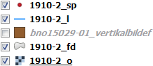

## Lage projeksjonsfil

Man kan lage projeksjonsfil (*.prj) på ulike måter:

1. Kopier en eksisterende prj-fil med ønsket projeksjon/koordinatsystem og gi samme filnavn som shp-fila.

2. Søk etter define i søkefeltet i nedre venstre hjørne i QGIS-vinduet. Velg Define layer projection.

3. Åpne verktøykassa (Ctrl-Alt-T) og velg Vector general – Define layer projection

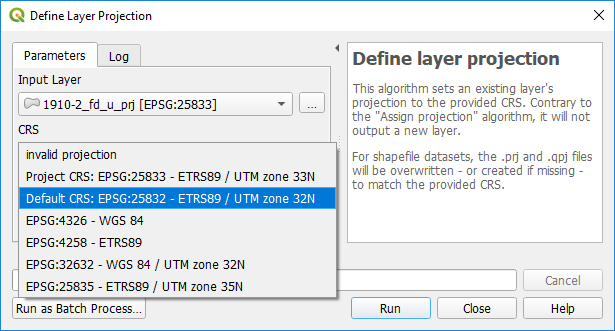

Klikk Run. Gå til filutforsker og sjekk at ```1910-2_f_u_prj.prj``` er blitt opprettet.

Projeksjonsfila er en tekstfil. Åpner denne i en teksteditor.

Prj-fil for projiserte koordinater:

```
PROJCS["ETRS89 / UTM zone 32N",GEOGCS["ETRS89",DATUM["European_Terrestrial_Reference_System_1989",SPHEROID["GRS 1980",
6378137,298.257222101,AUTHORITY["EPSG","7019"]],TOWGS84[0,0,0,0,0,0,0],AUTHORITY["EPSG","6258"]],
PRIMEM["Greenwich",0,AUTHORITY["EPSG","8901"]],UNIT["degree",0.0174532925199433,AUTHORITY["EPSG","9122"]],AUTHORITY["EPSG","4258"]],PROJECTION["Transverse_Mercator"],PARAMETER["latitude_of_origin",0],PARAMETER["central_meridian",9],PARAMETER["scale_factor",0.9996],PARAMETER["false_easting",500000],PARAMETER["false_northing",0],UNIT["metre",1,AUTHORITY["EPSG","9001"]],AXIS["Easting",EAST],AXIS["Northing",NORTH],AUTHORITY["EPSG","25832"]]
```

Prj-fil for geografiske koordinater:

```
GEOGCS["ETRS89",DATUM["D_ETRS_1989",SPHEROID["GRS_1980",6378137,298.257222101]],PRIMEM["Greenwich",0],UNIT["Degree",0.017453292519943295]]
```

## Lage ei ny shapefil

Klikk Layer – Create Layer – New Shapefile Layer.


Angi destinasjon og filnavn forekomster_p (inkluderer p med tanke på visning i Filutforsker)

Egenskapen id dukker opp som default. Denne kan velges og så slettes med «Remove Field».

Legg til egenskaper med «Add to Fields List» etter at navn **(NB! Shape takler maks. 10 tegn i egenskapsnavn, jf. kap. 5.)** og datatype og lengde er oppgitt.
Take me to [Kappitel 5](#kap5)

Lengde angir maks. tillatte tegn eller siffer: vil ikke kunne taste inn navn > 25 tegn eller antall > 999) med «Add to Fields List».


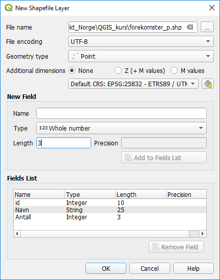

Klikk OK. Tast inn og klikk OK.

Shapefila (kartlaget) forekomster_p dukker opp i lagslista (legg merke til punktsymbolet).

Lager man en prj-fil til en eksisterende shapefil får denne prj-fila samme innhold som qpj-fila som lages når ny shapefil opprettes. Sammenlikn 1910-2_f_u_prj.prj med forekomster_p.prj – begge inneholder EPSG-kode.

## Tegnsett

.cpg setter code page for dbf-fila for å identifisere hvilken tegnkodingsstandard (character encoding) som skal brukes for å tyde dbf-fila. Tekstfila forekomster_p.cpg inneholder kun UTF-8.

**Unicode** (påbegynt 1987) er en datamaskin(computing industry)-standard for konsekvent koding, representasjon og håndtering av tekst. Unicode kan implementeres gjennom ulike tegnkodingsstandarder (f.eks. UTF-8). Tegnsettet omfatter hele 1 114 112 tegn.

**ASCII** (American Standard Code for Information Interchange, påbegynt 1960) er en tegnkodingsstandard og omfatter 128 tegn (code points), men mangler æ, ø og å.

**UTF-8** (Unicode Transformation Format – 8-bit, påbegynt 1992) er en tegnkodingsstandard for å tolke alle mulige tegn (code points) definert i tegnsettet Unicode.

UTF-8 opererer med variabel lengde fra 1 til 4 bolker à 8 bits (dvs. 1 til 4 byte) for å representere et Unicode-tegn. UTF-8 bruker 1 byte (8 bits) for et hvilket som helst ASCII-tegn (som er de 128 første tegna i Unicode).

Hovedregel: **Bruk UTF-8**.

I tillegg kan man støte borti tegnsettene DOSN8 (MS-DOS Norsk 8 bits) og ISO8859-10 (internasjonalt 8-bits) som er en variant av ISO8859-1 for samiske tegn.

## Hente inn en csv-fil med koordinater

Gå til ```04_tabeller\``` og åpne ```Tab_m_koordinater_u33.csv``` i Excel. Legg merke til at øverste rad (=første post) inneholder kolonnenavn (egenskapsnavn).

Klikk Open Data Source Manager – Delimited Text.

Angi fil (kan klikke og dra fila rett inn i filnavnfeltet fra Utforsker), koding (UTF-8) skilletegn, at første post (= øverste rad) har feltnavn, punktkoordinater og koordinatsystem. Rull bortover og se at æ, ø og å vises. NB! Hvis komma er desimalskilletegn, må det angis ellers vises ikke dataene.

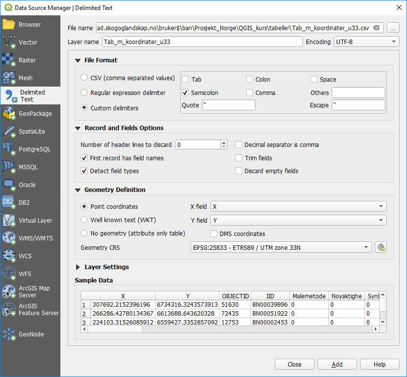

**Demo**: Bytt om på X og Y. Punktene havner, selvsagt, på galt sted.

**Demo**: Bruk gal CRS. EPSG 25832: Punktene havner feil (for langt til venstre pga. gal sentralmeridian)

**Demo**: Bytt til enkoding System. Da vil æ, ø og å ikke vises korrekt. Bytt tilbake til UTF-8.

Klikk Add og Close.

Velg punktlaget og zoom til dette laget. Slå ev. på Topografisk Norgeskart gråtone. Ser at punktene ligger på Østlandet. Åpner egenskapstabellen og ser at æ, ø og å vises korrekt. 

Kartlaget er fortsatt en csv-fil selv om «radene»/ forekomstene vises som punkter. Vis lags¬informasjon ved å holde cursor over lagsnavnet eller dobbelt¬klikke på kartlaget og velg Information-fana.

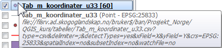


## Lagre csv-fil som shapefil

Man kan nå lagre kartlaget som en punkt-shapefil i ønsket koordinatsystem.

Høyreklikk på punktlaget og velg 
Export – Save Features As

Angir filformat, destinasjon og informativt/ hensiktsmessig filnavn, koordinatsystem og hvilke egenskaper som skal eksporteres. 

Her **kan man transformere** til et annet koordinatsystem ved å velge en annen CRS enn det csv-fila opprinnelig er i. Ønsker man at resultatfila (den nye punkt-shapefila) skal være i UTM32, oppgir man EPSG:25832 som CRS. 

Klikk OK. 
En ny shapefil legges til i lagslista.


## Transformere ei shapefil fra et koordinatsystem til et annet

Har man ei shapefil i ett koordinatsystem, kan man transformere

- hele fila (alle objekter)

- et utvalg av objekter (gjør i så fall utvalget **før** transformasjonen)

over i et annet koordinatsystem.

Skriv inn "transfo" i søkefeltet i nedre venstre hjørne, og dobbeltklikk på **Reproject layer** under ```«Processing Algorithms»```. Angi input layer og ønsket koordinatsystem. Har man på forhånd gjort et utvalg (plukket ut noen objekter fra datasettet man vil transformere), må man huke av for «Selected features only».  I første omgang lagres resultatet i et midlertidig kartlag. Klikk Run.


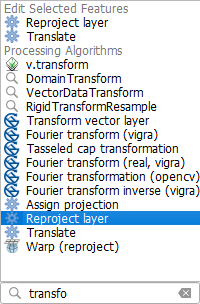 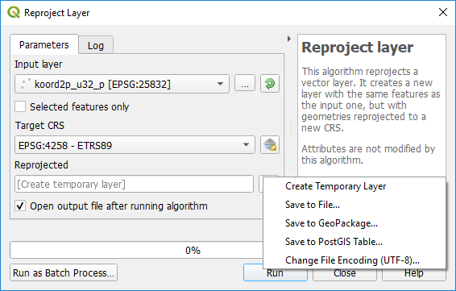

Et nytt, temporært lag «Reprojected» dukker opp i lagslista (notér symbolet til høyre for lagsnavnet).

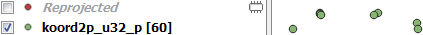 

NB! Temporære lag lagres ikke selv om prosjektet lagres.

**Demo**: Lukker man QGIS som inneholder midlertidig kartlag, får man en advarsel slik at man kan kansellere lukkingen og lagre temporære lag før QGIS lukkes.

Sjekk resultatet: Punktene fra begge klartlag, som er i hvert sitt koordinatsystem, skal sammenfalle (ha lik plassering) siden **QGIS foretar en «on-the-fly» transformasjon** for å vise kartlagene i koordinatsystemet som er valgt for det aktuelle prosjektet. (Man kan altså f.eks. ha satt prosjektkoordinatsystemet til 25832 (Euref89 UTM sone 32N) og vise datasett med objekter lagret i 25833 (Euref89 UTM sone 33N) eller 4258 (Euref89 desimalgrader) eller andre CRS.)

Hvis ok, lagres kartlaget i en ny shapefil. Høyreklikker på Reprojected, velger Export – Save Features As og angir destinasjon og navn og klikker OK, jf. kap. 4.6.

## Beregne koordinater, lengder og arealer

### Koordinater

Hent inn shapefilene fra ```\01_oppstart\shape``` om disse ikke allerede ligger inne.

Åpner egenskapstabellen til ```1910-2_ssu``` og slår på **redigeringsmodus**. 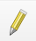

Vi skal nå beregne x- og x-koordinatene til de 10 punktene i både UTM 32N og UTM 33N.

Shapefila er i UTM 32N.

Åpner Field calculator 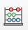 og legger til en ny egenskap x_u32 av typen desimaltall med 4 desimaler og beregner x-koordinaten med **```$x```** (ligger under Geometry i funksjonslista).

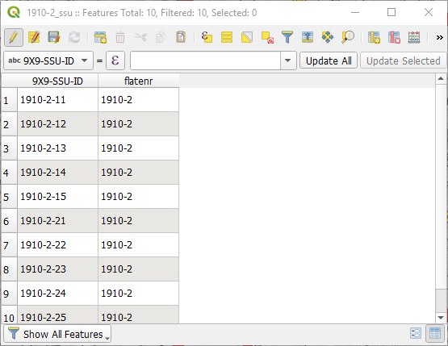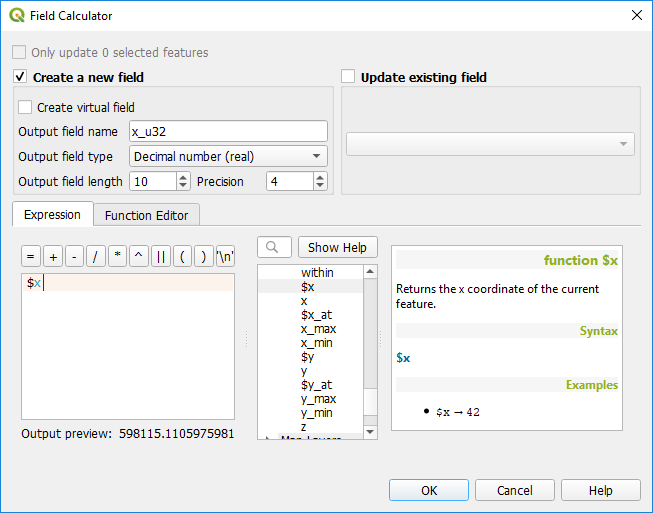

Klikk OK. En ny kolonne med punktenes x-koordinat legges til i egenskapstabellen. Beregner y-koordinaten på tilsvarende måte med **```$y```**.

Beregner til slutt koordinatene i UTM 33N. Siden geometriene (punktene) originalt ligger i UTM 32N, må de transformeres til UTM33N under beregningen av koordinater. Dette gjøres vha. uttrykkene

```x(transform($geometry,'EPSG:25832','EPSG:25833'))```

```y(transform($geometry,'EPSG:25832','EPSG:25833'))```

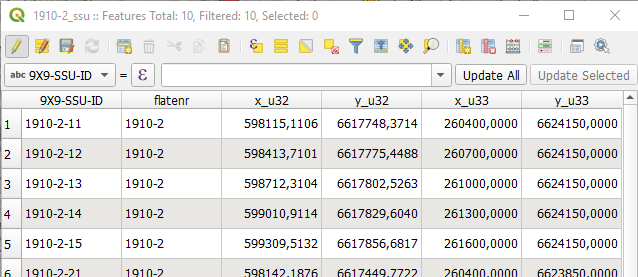

Vil man ta vare på endringene, lagrer man (klikker på disketten med blyant i tabellmenyen).

Glemmer man å lagre, får man en advarsel idet man avslutter redigeringsmodus eller lukker QGIS.

**NB! Man lagrer prosjektet og redigeringer for seg.** Det er forskjell på å lagre endringer i prosjektet 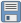 og å lagre endringer i kartlaget (fila) . Når man lagrer prosjektet, blir ikke endringer i filer oppdatert.

### Lengder og areal

Åpner egenskapstabellen til ```1910-2_l``` og slår på redigeringsmodus. Lag en ny egenskap i attributtabellen ```lengde``` (Decimal number - real) med 2 desimaler og bruk funksjonen ```length($geometry)``` under Geometry (lengder i meter i UTM 32N).

Åpner egenskapstabellen til ```1910-2_f``` og slår på redigeringsmodus. Lag en ny egenskap ```areal``` med 3 desimaler og bruk funksjonen ```area($geometry)``` under Geometry (areal i kvadratmeter i UTM 32N).

**NB! Bruk length() og area() for planimetriske verdier.** Da slipper du å ta stilling til hvorvidt ellipsoide er angitt eller ei under Measurements i Genaral-fanen under Project – Properties.

Under vises forskjellene mellom å angi ellipsoide eller ei:

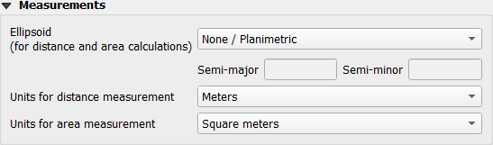


Measure area 
Ulikt resultat avh. planimetrisk eller ellipsoidisk	Likt resultat (naturlig nok) 

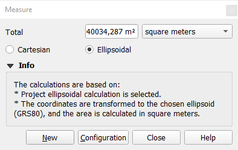

#### area($geometry)
*"Returns the area of a geometry polygon object. Calculations are always planimetric in the Spatial Reference System (SRS) of this geometry, and the units of the returned area will match the units for the SRS. This differs from the calculations performed by the $area function, which will perform ellipsoidal calculations based on the project's ellipsoid and area unit settings."*
[Qgis Documentation](https://docs.qgis.org/3.40/en/docs/user_manual/expressions/functions_list.html#id25)
#### $area
*"Returns the area of the current feature. The area calculated by this function respects both the current project's ellipsoid setting and area unit settings. For example, if an ellipsoid has been set for the project then the calculated area will be ellipsoidal, and if no ellipsoid is set then the calculated area will be planimetric."*
[Qgis Documentation](https://docs.qgis.org/3.40/en/docs/user_manual/expressions/functions_list.html#area)

Ellipsoide angitt


Ellipsoide ikke angitt (dermed like areal da både area($geometry) og $area beregnes i planet)


Kilde: https://gis.stackexchange.com/questions/343165/error-in-area-calculation

# 5. GeoPackage

GeoPackage-formatet (GPKG) er plattformuavhengig og implementeres som en SQLite-databasecontainer, og kan brukes til å lagre både vektor- og rasterdata. Formatet ble definert av Open Geospatial Consortium (OGC) og ble publisert i 2014.

GeoPackage kan brukes til å lagre følgende i en SQLite-database:

- vektorfunksjoner

- flismatrisesett med bilder og rasterkart

- attributter (ikke-romlige data)

- utvidelser

Siden QGIS versjon 3.8 kan GeoPackage også lagre QGIS-prosjekter. GeoPackage-lag kan ha JSON-felt.

GeoPackage er standardformatet for vektordata i QGIS.

# 6. Plugins (programtillegg)

Programtillegg i QGIS er små utvidelser som legger til ekstra funksjonalitet i programmet, for eksempel nye analyseverktøy eller støtte for spesifikke dataformater. De kan installeres direkte fra QGIS ved å trykke på ```Plugins - Manage and Install Plugins - All```. Man kan filtrere på både offisielle og brukerlagde tillegg. 

Et eksempel er **"GBIF Occurrences"**  som lar deg søke etter og laste ned artsforekomster direkte fra GBIF (Global Biodiversity Information Facility) sitt API. Dette gir deg rask tilgang til globale biodiversitetsdata uten å forlate QGIS. Søk etter "GBIF" og så klikk "Install Plugin". 


Du kan søke etter arter ved å bruke vitenskapelige navn og filtrere etter kriterier som observasjonstype, år og geografisk område. Resultatene lastes inn som midlertidige punktlag i QGIS, med attributtabeller som inneholder metadata som dato, datakilde og koordinater. Du kan lagre disse lagene permanent i formater som GeoPackage eller shapefil for videre analyse.

For denne øvelsen vil vi bruke ramsløk som et eksempel. Skriv "allium ursinum" i vitenskapelig navn feltet


mer info om nyttige plugins [her](https://docs.qgis.org/3.40/en/docs/training_manual/qgis_plugins/plugin_examples.html)

# 7. Digitalisering (kartlegging)

Med digitalisering mener vi å tegne (konstruere) ulike geometrier (punkter, linjer og polygoner). Nye objekter (features) lages og lagres i hver sin shapefil avhengig av geometritype: punkter lagres i punktshapefil, linjer i linjeshapefile og polygoner i polygonshapefil. Alternativt kan man lage en ny GeoPackage-fil (*.gpkg) og legge til nye kartlag med ønskede egenskaper og geometritype. Velg fra toppmenyen ```Layer – Create Layer – New GeoPackage Layer```.

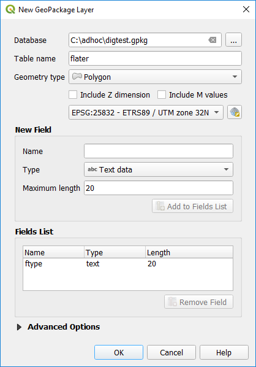


## Tilleggsinformasjon og GPS

Hent inn andre datasett (f.eks. topografiske kart eller flybilder (ortofoto) fra WMS eller som rasterfiler) som skal brukes som bakgrunnsinformasjon og være til hjelp under digitaliseringen.

Jobber man ute i felt på feltbrett (nettbrett eller feltpc) med innebygd GPS-mottaker, kan man aktivere QGIS sin GPS-modul slik at man lettere kan se hvor man befinner seg om man har flybilde eller kart i bakgrunnen. Velg ```Visning – Paneler – GPS Informasjons-panel``` og klikk på «Koble til».

Hvilken forbindelse du bør velge, avhenger av enheten. De fleste feltbrett med integrert GPS vil finne denne vha. autosporing. På Windows felt-PC må posisjon (Location) være påskrudd (se under Innstillinger).

## Tegn og registrer

Hent inn kartlaget (shape, GeoPackage) hvor nye objekter skal legges til eller lag en shapefil/kartlag for ønsket geometritype, se kap. 4.3.

Zoom inn til aktuelt område og sett passende målestokk. Målestokken avhenger av minste kartleggingsenhet, nøyaktighetskrav og hvor entydig definert det man skal kartlegge er. Man punkt-registrerer f.eks. kumlokk mer nøyaktig enn trær. Ved kartlegging for Natur i Norge (NiN) i målestokk 1:5000 hvor minste arealstørrelse er 500 m2, kan passe zoom-nivå være 1:600-1:800, mens for kumlokk og sluk kan 1:100 være passe.

Uavhengig om man starter med en tom fil eller skal legge til objekter i en eksisterende fil, kan man velge om man skal vise alle objekter på samme måte eller om man skal vise de ulikt basert på egenskapsverdier. Sett Symbology til hhv. Single elle Categorized.

Sett aktuelt kartlag i redigeringsmodus (klikk på «blyanten»).

Velg ```Add Point Feature / Line Feature / Polygon Feature``` avhengig av shapefilas geometritype.


Start med å digitalisere et objekt. Etter endt registrering dukker et skjema opp, jf. egenskapstabellen til kartlaget. Angi verdier i henhold til skjemaoppsettet og klikk OK (ev. Cancel hvis noe gikk skeis).

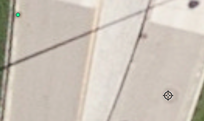
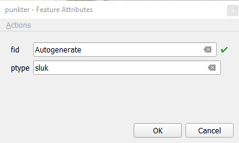


Kan vise sluk og kummer likt eller ulikt.


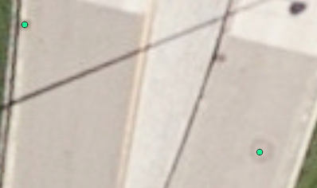
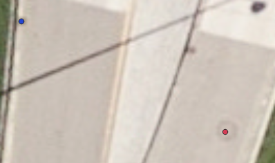

Man kan enkelt slette registreringer i etterkant, enten rett etter endt registrering med **«Undo»** eller ved å velte aktuelt objekt og trykke Del-tasten (eller klikke på Søppelbøtta). 

Man angrer en handling med «Undo» og «Redo» vha. .

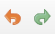

## Tegneregler

Før digitaliseringen starter kan man sette hensiktsmessige tegneregler i QGIS. Sett snappe-regler i ```Project – Snapping options``` i henhold til dine behov (anbefalt toleranse er 1–5 m avhengig av målestokk og å snappe til både knekkpunkter og linjesegment).

Det anbefales å aktivere både ```«Topological Editing»``` og ```«Avoid overlap»``` for å sikre at det ikke er gliper mellom polygoner, og at polygoner ikke overlapper. Topological Editing betyr at når man flytter ei opprinnelig grenselinje, følger nabopolygongrense med, mens Avoid overlap hindrer overlappende polygoner.


Man har tilgang til de samme mulighetene via Snapping Toolbar:


## Områdeavgrensning

Lag et 10–50 m bredt omriss rundt kartleggingsområdet som du skal kartlegge i.

1. Opprett et nytt kartlag (ny polygonshapefil eller polygonlag i GeoPackagefila). Digitaliser omrissområdet.
2. Bufre f.eks. 20 m rundt denne omrisspolygonen (```Vector – Geoprocessing Tools – Buffer```)
3. Klipp ut opprinnelig omrissområde fra bufferområde (```Vector – Geoprocessing Tools – Difference```) Lagre det resulterende omrisslaget som en ny shapefil (f.eks. kartlgrense_f).

Hak av ```«Avoid overlap»``` i snapping settings for dette omrisslaget.

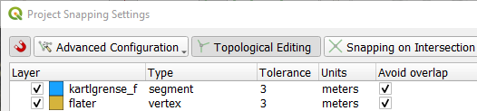

Da vil polygoner som overlapper omrisset, automatisk bli klippet mot omrisset.

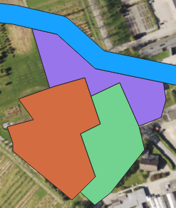

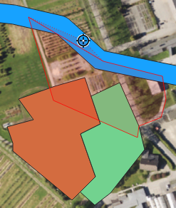

## Sikre lovlig geometri og topologi

For å se og unngå feil underveis i digitalisering, kan man slå på geometri- og topologisjekker i kartlaget under Properties – Digitizing. Man har ulike muligheter avhengig av kartlagtes geometritype.

Huker man av for «Is Valid» under Geometry checks, får man ikke lagret redigeringene så lenge det forekommer feil. Man advares om geometrifeil underveis (grønne kryss) i digitaliseringen. Overses feilen, får man feilmelding i et eget vindu.

I eksempelet under krysser polygonen seg selv.


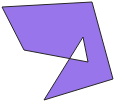

Man får opp Geometry Validation-vindu med feilmelding:


Har man likevel oversett feil og klikker for å lagre, vil man få opp en advarsel om at feil må fikses før lagring kan skje.

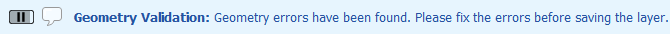

## Digitaliseringstips

QGIS tilbyr mange muligheter til å sikre effektiv digitalisering og til å rette og endre kartlegging i ettertid. Man kan f.eks. redigere polygongrensene, og man kan slå sammen polygoner og arve egenskapsverdier fra den ene. Slå på både Digitizing Toolbar og Advanced Digitizing Toolbar.

**Flytte på hjørne- / knekkpunkt (eng. vertex)**

Bruk Vertex Tool.


Legge til knekkpunkt: dobbeltklikk mellom to eksisterende punkter der du vil opprette nytt punkt.

Flytte knekkpunkt: klikk på aktuelt punkt, og dra det til ønsket posisjon.

Fjerne knekkpunkt: klikk på aktuelt punkt og trykk «Backspace» eller «Delete» på tastaturet. (På felt-PC må skjermtastaturet være aktivert.)

**Dele / splitte en polygon**

Bruk Split Features. Tegn en linje som polygonen skal deles langs. **Start og avslutt utenfor polygonen**. Høyreklikk for å splitte. 
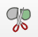

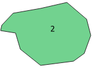 
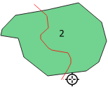 
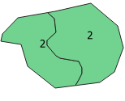
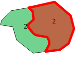
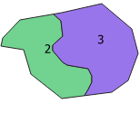

Husk å endre egenskapsverdiene til den ene delen vha. Identify Features .

**Slå sammen polygoner**

Velg polygoner med Select Features .


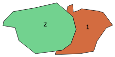

Klikk Slå Sammen valgte objekter 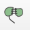.


Velg hvilke egenskaper (fra hvilken figur) du vil beholde, og klikk «Take attributes from selected feature».

 

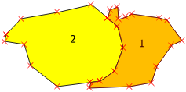 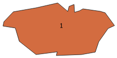

**Kopiere over egenskaper**

Egenskaper (arealdekke / arealbruk) gjentar seg. Det er enkelt å gjenbruke informasjon. Kopier verdiene fra en figur til en nytegna vha. Select Features og Merge Attributes of Selected Features. 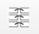


**Slette polygon**

Velg polygon(er), og slett med Delete Selected (eller trykk «Backspace»- eller «Delete»-tasten). 

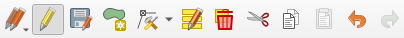

**Måle lengder og areal**

Mål avstand med Measure Line. Bytt til Measure Area for å måle areal (bruk cartesian hvis projeksjon er satt i prosjektet).


**Se på egenskaper og verdier til en figur**

Bruk Identify Features. 

I redigeringsmodus kan du også redigere egenskapsverdiene med Identify. Kommer ikke skjemaet opp, men derimot et eget resultatvindu, hak av feltet «Auto open form».

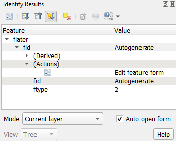

Lukk vinduet og åpne det på nytt med Identify. Skjemaet dukker opp, og man kan endre verdier.

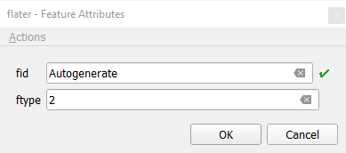

Lagre registreringer ofte

NB! Man lagrer prosjektet og redigeringer for seg. 

Det er forskjell på å lagre endringer i prosjektet   og å lagre endringer i kartlaget (fila). Selv om man lagrer prosjektet blir ikke endringer i filer oppdatert.

Bruk ```Save Layer Edits``` ofte slik at du ikke mister (for mye) data hvis QGIS, PC eller feltbrett feiler.


Avslutt redigering med å klikke på ```Toggle Editing```.

Save prosject lagrer hele prosjektet. Har det skjedd i endringer i prosjektet (kartlag har kommet til, blitt fjernet eller fått endret stil, filtrering e.l.), vil det komme ei lita stjerna foran prosjektnavnet. Denne stjerna forsvinner ved lagring av prosjektet.


## Feilsøk, korrigeringer og kontroll

Etter endt registrering må man kontrollere at alt er korrekt digitalisert. Har man satt hensiktsmessige tegneregler, skal ikke overlappende polygoner forekomme (med mindre det er tillatt, jf. miljøregistreringer i skog). Under digitaliseringen får man advarsel hvis polygonen krysser seg selv. Oppdages ikke dette, vil figuren bli flatedannet, men «Avoid overlap» i kap. 1.3 vil ikke fungere. Man risikerer delvis overlappende figurer ved lagring med mindre man ikke har haket av for «Is Valid» under Geometry checks i lagegenskaper, se kap. 1.5


QGIS tilbyr gode muligheter for å finne og rette feil i etterkant.

## Topology Checker

Det er viktig at topologien i kartet er riktig. Topologifeil vises, som nevnt, med grønt kryss. Sjekk alltid topologien i ettertid med Topology Checker (Topologikontrollør). Dette er et førhåndsinstallert programtillegg som aktiveres i Plugins – Manage and Install Plugins. Skriv inn «topol» og hak av Topology Checker (Topologikontrollør).

```Velg Vector – Topology Checker```.

Legg til topologiregler med Configure.


Sett spesifikke regler for å kontrollere polygoner for feil.


Sjekk om topologien til kartet ditt er riktig med Validate All.

Er fila stor, kan man zoome inn til et et og et område og bruke ```Validate Extent``` .


Hak av for «Show errors» slik at polygoner med ugyldig geometri fremheves.


Retter feilen og kjører sjekken på nytt.


Her er det greiest å slette figuren som feilaktig overlapper naboer og heller tegne det på nytt slik at det automatisk klippes til sine naboer.

Kjører topologisjekken på nytt helt til ingen feil forekommer.


# 8. Kartografi

Man kan endre utseendet på alle geometrityper, f.eks. symbol, farge, størrelse/tykkelse, skygge m.m. Det er nærmest bare fantasien som setter grenser. Man bør dog begrense seg og holde seg til at less is more. Det er viktig å ha leseren (av kartillustrasjon i artikkel) og brukeren (av kartet) i fokus.

Hent inn

```\01_oppstart\shape\1910-2_ssu.shp```, ```1910-2_l.shp```, ```1910-2_f.shp```

```\01_oppstart\raster\1910-2_o.png```

Slå på Layer styling-panelet, og påse at Live Update er slått på. Her kan man foreta undo/redo.


**Aktiver punktlaget.** Velg Single symbol. Klikk på Simple marker og se alle valgene man har/parameterne man kan endre.

Man kan endre Symbol layer type. Prøv litt ulikt. Prøv ``Geometry generator``, og test ``Geometry type`` lik `Polygon` og uttrykket: ```buffer($geometry,20)```

Man kan endre farge på mange ulike måter. Man kan taste inn bestemme CMYK eller RGB-verdier eller velge farge vha. en innebygd «color picker» (pipette). 
Under ``Layer Rendering``, kan man slå på Draw effects og klikke på «stjerne-knappen». Da kan man legge på skygge eller glød. Prøv de ulike og se effekten.

NB! Effekter må brukes med omtanke. Det kan bli for mye av det gode!

Man kan gjøre symbolene (kartlaget) gjennomsiktig under Layer rendering.

**Aktiver linjelaget.** Lek deg litt slik som for punktlaget. Prøv Geometry generator, og test Geometry type lik Polygon og uttrykket: ```buffer($geometry,20)```


**Aktiver flatelaget.** Prøv litt forskjellig: ``Categorized``, ``Graduated``, ``Rule`` based osv. avhenger av egenskapen og dens verdier. Lag skravur ved å dobbeltklikke på det aktuelle symbolet og klikke på grønn pluss for å legge til et symbol til og endre fyllfarge og -stil. 
Velg Line pattern fill eller Point pattern fill ut fra ønsket skravur. 
Her kan man skreddersy utseendet mhp. tykkelse/størrelse, farge, tetthet, forskyving m.m.

  

## Påskrift
Velg flatelaget.
Via Layer Styling-panelet eller lagsegenskaper – Symbology, velg abc-fana og sett Single labels og velg å vise påskrift for egenskapen artype (labele with).

Prøv mulighetene og se hva som skjer: størrelse, farge, utmasking, skygge, plassering, målestokk og antall påskrifter (alle kan medføre overlappende påskrifter).


I tillegg kan man sette målestokksområder for når påskrifter skal vises og sette regler for skrift¬størrelse avhengig av målestokk (zoom-nivå). Dette er mest aktuelt under digitalisering når man zoomer mye ut og inn og gjerne vil ha informasjon synlig når man zoomer inn, men ikke når man zoomer ut for å få oversikt. 

1:9000  

1:11 000 

**Eksempler**: Påskriften kan være basert på en egenskap eller flere, ha linjeskift, spesielle tegn og stil.
Prøv følgene utryk på ```1910-2_f``` kartlaget:

```"artype" || '-' || "artreslag" ```

```"artype" || '/' || '\n' || "artreslag"```

```"artype" || '*' || "artreslag" ```
OG i Formatting angi * (valgfritt tegn) som «wrap character».

```round(area($geometry),2) || ' m<sup>2</sup>'``` gir ulik preview og påskrift.

```round(area($geometry),2) || ' m²'``` med Alt 0178 for ² (Alt 0179 gir ³)

Man kan sette **regler** (lage uttrykk) for f.eks. farge og størrelse på påskrift avhengig av egenskapsverdi og målestokk (skriften øker/minker ved zoom inn/ut). Klikk på Expression-knappen, så Edit og angi uttrykk. Knappen er gul om den inneholder et aktivt uttrykk.

Eksempler: Påskriftstørrelse basert på målestokk og påskriftfarge basert på egenskapsverdi til artype.
```
CASE
  WHEN @map_scale < 600 THEN 30
  WHEN @map_scale < 2600 THEN 16
  WHEN @map_scale < 9000 THEN 10
  ELSE 6
END
```

```
CASE
  WHEN "artype" = 21 THEN color_rgb(255,20,20)  -- red
  ELSE color_rgb(0,0,0)                         -- black
END
```

Bruk ```@symbol_color``` i farge-uttrykket for å ha samme farge på påskrift som på punktene, linjene eller polygonene.

**Slå av/på uttrykk** med Deactivate/Activate, eller slett hele uttrykket med Clear.

**Flytte** påskrifter med Move Label and Diagram på Label toolbar.


Klikk på påskriften som skal flyttes. Første gang spørres det etter en intern primærnøkkel.


Klikk igjen på aktuell påskrift og dra den til ny posisjon. (Under Layer Styling – Label – Placement – Data defined vil de to uttrykksikonene bli gule. )


Tydeliggjøre hvilken påskrift som hører til hvilken polygon kan man sette på **callouts**. 


Vise hvilke påskrifter som er blitt flyttet på med Highlight pinned labels   

Vise uplasserte/over¬lappende påskrifter   (vise alle påskrifter må være avslått) 


## Stiler (styles)

Man kan lagre symboler (og påskrift) i stilfiler for senere bruk.

Åpne lagsegenskaper til flatelaget, og klikk på `Style` nederst og velg ``Save style``, angi format, kategorier (hva som skal lagres) destinasjon og filnavn. Formatet QML kan kun leses av QGIS. SLD kan leses av andre GIS-programmer. Neste gang man åpner en tilsvarende fil (reir klipt mot AR5 i andre ruter), kan man gjenbruke stilfila man har laget nå (Style – Load Style).

Heter qml-fila det samme som shapefila, vil kartlaget tegnes direkte med riktige farger og symboler.

Man kan også kopiere style fra et lag til et/flere andre. Høyreklikk på aktuelt kartlag, velg `Styles – Copy Style` og velg alt eller bestemt(e) kategorier. Marker et eller flere destinasjonslag og høyreklikk og velg `Styles – Paste Style` og oppgi alle/kategorier hvis ett destinasjonslag.

**Oppgave:** Kopier påskrift fra et annet lag til ```reir_ar5_f_s```.

Usikker på hvilke farger som kan passe sammen? Bruk http://colorbrewer2.org. Her kan man snevre inn fargealternativer basert på type data (rangert, divergerende eller kvalitative) og hvorvidt man skal ta hensyn til f.eks. fargeblindhet, printing og fargekopiering. Man kan kopiere inn ønsket farge fra colorbrewer til QGIS ved å angi RGB- eller CMYK-verdier, bruke pipette fra QGIS eller notere seg fargeskalanavnet og angi denne i QGIS.


I QGIS kan man vise hvordan fargene vil fortone seg i gråtoner eller for fargeblinde m.m.

Velg View – Preview Mode og velg ønsket simulering.
- Normal	
- Photocopy (greyscale)	
- Color blindness (protanope)


## Show Map tips

I tillegg til (eller i stedet for) påskrift, kan man vise **karttips** (tekst som vises når man holder cursor over et objekt).

Marker flatelaget og åpn lagsegenskaper og velg Display-fanen.

Angi et uttrykk, enten en enkelt egenskap eller noe mer sammensatt, f.eks. areal-uttrykket fra tidligere: `round(area($geometry),2) || ' m<sup>2</sup>'`

Hold cursor over en polygon, og arealtallet vises.


Alternativt kan man bruke HTML. Angi et uttrykk, og klikk Insert. Uttrykket endres til HTML-kode. Arealtallet vises på samme måte. (HTML «trumfer» Display Name.)


Med HTML kan man stile karttipset med alle style-muligheter som HTML tilbyr.

Eksempel:

``<!DOCTYPE html>
<html>
<body>
<p>I am normal</p>
<p style="color:red;">I am red</p>
<p style="color:blue; font-size:120%;font-family:Verdana">[% round(area($geometry),2) || ' m<sup>2</sup>' %]</p>
</body>
</html>``

Et fint startsted for å lære mer HTML: https://www.w3schools.com/ 

## Layout

Man kan ta skjermdumper (klippe ut) dirkete fra kartvinduet (map canvas), f.eks. med greenshot (www.getgreenshot.org).
I mange tilfeller vil dette duge: presentasjoner, interne dokumenter o.l.

I canvas kan man legge til ulike kart¬elementer via View – Decorations.

Andre ganger trenger man mer forseggjorte kart til papir- eller illustrasjons-bruk. Da brukes QGIS sin kartmodul «Layout Manager» 


[QGIS-manualen:](https://docs.qgis.org/testing/en/docs/user_manual/print_composer/overview_composer.html])

**NB! Tenk gjennom hensikten med kartet. Lag skisser for hånd med hensyn til «balanse».**

Hva skal kartet fortelle? Hvilke elementer må da med (ev. krav fra utgiver)? Er nordpil og grid nødvendig? Må man ha med stedsnavn? Bakgrunnskart? Husk less is more – tydeliggjør budskapet.

Hent inn ``\05_kartografi\reir_ar5_f_s.shp``. Kartlaget tegnes med bestemte farger og påskrift da den tilhørende qml-fila (med samme «fornavn») ligger i samme mappe. Aktiver dette kartlaget og zoom inn til ruta i nordvestre hjørne. Sett målestokken til 1:4000.

Velg `Project – New Print Layout` og angi et navn. (Alternativt: Klikk Layout Manager og så Create (Empty layout) og angi et navn.) Et nytt layout-vindu åpnes.

Høyreklikk på arket og sett arkstørrelse og retning (Page properties, A4 liggende).

Start med å legge til et kart med . 
Kartlaget vises. Klikk «Set Map Scale to Match Main Canvas Scale». Kartutsnittet tegnes innafor kartramma i målestokk 1:4000. 

Flytter og endrer kartelementstørrelse med  og mer nøyaktig under Item properties-fanen og «Position and Size». NB! Når man er fornøyd huker man av for Lock Layers.

Gi kartelementet navn (default er Map 1): map nv.

Setter inn flere kartelementer og lar alle elementnavn inneholde nv (scale nv, legend nv osv.):

-	overskrift (label).
-	målestokk – gjerne både som linjal (scale bar) og tall (numeric).
- tegnforklaring. Det er god kartografi kun å ha med objekttyper i tegnforklaringen som er med i kartet (slik at man ikke leter etter forekomster oppgitt i forklaringen som ikke finnes i kartet). Klikk da på trakten for å filtrere tegnforklaring basert på kartinnhold.
Slå av Auto update, høyreklikk på overskriften (kartlagsnavnet) og velg Hidden. Skriv inn tittel Arealtyper. Velg skrift og størrelse under Fonts og mellomrom (luft/avstander) under Spacing.
-	rutenett med koordinater under Grids.


Skal vise flere habitat på samme kart (i samme illustrasjon), dvs. sette inn ei rute (et habitat) til.
Gå til QGIS og zoom inn på ruta i sørøst (målestokk 1:4000).
I stedet for å starte på nytt, tar vi en kopi av kartelementa vi allerede har og limer de inn ved siden av i flukt med det først kartet. Endrer fra nv til sø i elementnavna. (Valgt kart-element vises i fet skrift i Item-lista.)
Velg det nye kartet og slå av Lock layers og klikk på «Set Map Extent to Match Main Canvas Extent» og så på «Set Map Scale to Match Main Canvas Scale» Da vises sørøstre kartutsnitt i 1:4000.

Sentrer kartet. Slå på Lock layers. Både for målestokk og tegnforklaring må vi oppgi map sø som kartreferanse.
Ruta i sørøst inneholder færre arealtyper enn ruta i nordvest. Lagrer layout.

 

Gjør man endringer i kartvinduet (map canvas i QGIS), klikker man på Refresh view (F5)  i Layout. Husk å ha Lock layers påslått (ellers vil kartutsnittene kunne endre seg om man har zoomet inn til et annet område i kartvinduet).


Hent inn ```\06_analyse\koord2p_u32_p.shp``` i QGIS.

Legg punktlaget over flatelaget (reir_ar5_f_s) og ha begge påslått.

I Layout vil ikke punktene i utgangspunktene være synlige. Aktiver aktuelt kart og slå av Lock layers. Da dukker et rødt punkt opp. Slå på Lock layers igjen. Gjør tilsvarende for det andre kartet.

Vi må oppdatere tegnforklaringen. Klikk på pluss og legg til ``koord2p_u32_p`` og døp om til fuglereir. Gjenta for det andre kartet.

Til slutt kan vi eksportere kartet ut som et bilde. Klikk på Export as image . Man har mange bildefilformater å velge mellom. Mest vanlig er nok tif(f), jp(e)g og png avhengig av senere bruk.


Angi destinasjon og filnavn og deretter oppløsning (antall dpi) og ev. world-file og beskjæring (crop). Lagrer man bare kartet, kan man inkludere en world-file slik at bildet blir georeferert og kan hentes inn i QGIS og plasseres geografisk.

Lagrer Layout og avslutter Layout.

Lagrer prosjektet.

Neste gang prosjektet åpnes, vil man ha layouten (kartet) tilgjengelig via Layout Manager. (Forutsetter at de samme kartlagene eksiterer i prosjektet. Fjerner man et kartlag eller navner om et kartlag, kan det med føre at elementer mangler i layout eller må navnes om.)


Legg til ev. tilleggsopplysninger vha. tekstboks. (Beskrivelser, forklaringer, datum, projeksjon, når feltarbeidet har funnet sted, når kartet er laget, personer som har gjort hva, oppdragsgiver osv.)

# 9. Hjelp

Lurer på hvordan noe gjøres i QGIS? GPT har ofte gode svar!

Se i docs.qgis.org/testing/en/docs/index.html

Eller se hva andre har lagt ut: https://www.qgistutorials.com/en/ 

Let etter svar eller spør (men rtfm): https://gis.stackexchange.com/questions/tagged/qgis

Søk på nettet

Eller bare ring en venn (kollega).

Følg gjerne #QGIS på Twitter  angi #QGIS i søkefeltet.
