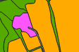

# Course in QGIS (3.x)

Author: Anne B. Nilsen NIBIO and Peter Horvath NHM

- [Course in QGIS (3.x)](#course-in-qgis-3x)
- [1. Get to know the QGIS setup](#1-get-to-know-the-qgis-setup)
    - [Project settings](#project-settings)
    - [Other settings](#other-settings)
    - [Relevant CRS (EPSG)](#relevant-crs-epsg)
  - [Importing vector and raster](#importing-vector-and-raster)
    - [Many ways to Rome!](#many-ways-to-rome)
  - [Retrieve WMS or WFS services](#retrieve-wms-or-wfs-services)
    - [Topographic WMS](#topographic-wms)
    - [AR50 WFS](#ar50-wfs)
    - [Choose a team and click Add.](#choose-a-team-and-click-add)
    - [Norge i bilder](#norge-i-bilder)
- [2. Access to geographic information (map data)](#2-access-to-geographic-information-map-data)
  - [Norway](#norway)
  - [World](#world)
    - [Global Geospatial Data Portals](#global-geospatial-data-portals)
- [3. SOSI](#3-sosi)
- [4. Shape](#4-shape)
  - [Importing data without projection information](#importing-data-without-projection-information)
  - [Create projection file](#create-projection-file)
  - [Create a new shapefile](#create-a-new-shapefile)
  - [Character Set](#character-set)
  - [Import a csv file with coordinates](#import-a-csv-file-with-coordinates)
  - [Save csv file as shapefile or Geopackage](#save-csv-file-as-shapefile-or-geopackage)
  - [Transforming a shapefile from one coordinate system to another](#transforming-a-shapefile-from-one-coordinate-system-to-another)
  - [Calculate coordinates, lengths, and areas](#calculate-coordinates-lengths-and-areas)
    - [Coordinates](#coordinates)
    - [Lengths and areas](#lengths-and-areas)
    - [Measure area](#measure-area)
      - [area($geometry)](#areageometry)
      - [$area](#area)
- [5. GeoPackage](#5-geopackage)
- [6. Plugins](#6-plugins)
- [7. Digitization (mapping)](#7-digitization-mapping)
  - [Additional Information and GPS](#additional-information-and-gps)
  - [Digitize and register](#digitize-and-register)
  - [Drawing rules](#drawing-rules)
  - [Area delineation](#area-delineation)
  - [Ensure legal geometry and topology](#ensure-legal-geometry-and-topology)
  - [Digitization Tips](#digitization-tips)
  - [Troubleshooting, Corrections, and Control](#troubleshooting-corrections-and-control)
  - [Topology Checker](#topology-checker)
- [8. Cartography](#8-cartography)
  - [Labeling](#labeling)
  - [Styles](#styles)
- [Color Selection in QGIS](#color-selection-in-qgis)
  - [Show Map Tips](#show-map-tips)
  - [Layout](#layout)
- [9. Help](#9-help)


# 1. Get to know the QGIS setup

Start QGIS. Various tools (icons), panels, and map windows will appear. The appearance and what should be available and visible, as well as sizes and language, can be customized to your own preferences and needs.


Right-click in the gray area in the top menu to turn on/off **panels** and **toolbars**.
The **toolbox** is located under Processing in the top menu ```(Ctrl-Alt-T)```. All tools are displayed on the right side. More tools: Settings - Options - Processing, enable GDAL, GRASS, etc.
You can search for functions directly in the search field in the lower left corner. Type in the desired word.

  

### Project settings

Project - Project properties

Tab General:
Use relative file path.
Click OK and Apply.
Change selection and/or background color if necessary.


### Other settings

After making changes, click OK. Some changes require restarting QGIS to take effect.
Settings - Options.

Tab General:
Prefer QGIS in English?
Change localization from Norwegian to English.

Make icons and text larger if needed.


Tab CRS:
Want a specific coordinate system as default?
Fetching one/few raster files with CRS different from the project: Specify CRS each time.
Fetching many raster files: Make sure project and raster files have the same coordinate system and check "Use project CRS", chap. 4.1.


Tab Data Sources:
Do not open the attribute table in a dockable window - for displaying attribute values with . Remove NULL for "blank display" for unset attribute values.


Tab Drawing:
Do not draw map layers when they are added. Smart for large datasets where you should zoom in before drawing.


QGIS is natural to use when you want to look at

- **vector** data (shapefiles)

- **raster** data (orthophotos, aerial images, satellite images)

- **WMS** and **WFS** services

- and/or perform **analyses** (get answers to questions) or extract new datasets (new shapefiles).

**Set coordinate system** (CRS - Coordinate Reference System or EPSG - The European Petroleum Survey Group).

(Find a nice overview at <https://register.geonorge.no/register/epsg-codes>.)

### Relevant CRS (EPSG)

Projected coordinate systems (EPSG, Description)

- 25832 Euref 89, UTM zone 32N (up to Trøndelag)
- 25833 Euref 89, UTM zone 33N (Nordland and Troms)
- 25835 Euref 89, UTM zone 35N (Finnmark)

Geographic coordinate systems

- 4258 Euref 89 decimal degrees
- 4326 WGS84 decimal degrees

List of all EPSG codes ("what and where"): <http://spatialreference.org/ref/epsg/>.
[UTM zones](https://en.wikipedia.org/wiki/Universal_Transverse_Mercator_coordinate_system#/media/File:Utm-zones.jpg) and [coordinates](https://en.wikipedia.org/wiki/Universal_Transverse_Mercator_coordinate_system).

## Importing vector and raster

### Many ways to Rome!

Use the Data Source Manager icon - Vector and navigate to the desired file, or much quicker, click and drag the shapefile directly from File Explorer to the QGIS window or use the Browser Panel. In the Browser panel, you have quick access to disks, databases, project directories. You can see the file type (shape, raster, table) and geometry type (point, line, polygon) using icons. Browser displays files that can be dragged into the canvas. See how the registry catalog is displayed in Browser vs. File Explorer. Browser displays different geometry types with the same symbol for shapefiles. For GeoPackage, the geometry type is distinguished.

   !

Retrieve the shapefiles (UTM32 N) from `\01_startup\shape` in File Explorer. (Tip! Sort by type.)
The vector files contain information about the coordinate system in the corresponding prj file.

**Layers** (shapefiles) are added in a specific order point, line, polygon and are assigned arbitrary colors except for shapefiles that have a corresponding style file (qml file with the same name as the shapefile).

**Pan** the map, **zoom** in and out, move back and forth between different zoom levels, zoom to layers, select scale, enter scale. Set different colors, **change layer order** and remove a layer.

Change symbols, colors, labels, copy styles, and save style files for reuse. If *.shp and *.qml have the same name and are saved in the same location, the style file will automatically be used when importing the shapefile.

**Raster files** do not contain information about the coordinate system. Depending on what you have chosen under the CRS tab in Settings, you will be asked about the coordinate system or QGIS will assume that the raster files have the same coordinate system as the project. More about this in chap. 4.1.

Retrieve the raster files (UTM32 N) from `\01_startup\raster` in File Explorer. (Tip! Sort by type.)

**Save the project** (specify location and name) ***.qgs** (an XML file about the layers and appearance in the project).

## Retrieve WMS or WFS services

**WMS** (Web Map Service) is a service where a server can send map snippets in the form of raster files back to the user on request, either directly in the browser, a web application, or a desktop application (here QGIS).

Click ```Open Data Source Manager - WMS/WMTS```. Click New.

Enter an informative optional name and URL (web address). But what is the address?

### Topographic WMS

Go to <www.geonorge.no>.
Search for topo, choose service and Topographic Norway Map grayscale.
The service contains topographic maps in scales from 1:500 to 1:10M, and N5 raster.

Copy the [URL address](https://wms.geonorge.no/skwms1/wms.topograatone?service=wms&request=getcapabilities) under Distribution (scroll down) and paste it into the WMS window in QGIS and click OK.


Select layers and click Add. Pay attention to the drawing order. If you choose the top layer (id 0), you get everything.

Alternatively, you can choose one or more specific layers.
Only the legend for the last selected layer is displayed.
(It may therefore be worthwhile to repeat the retrieval for one layer at a time.)
Note that sometimes you have to zoom in on the map for the layer to be displayed.


### AR50 WFS

Go to [Geonorge](https://www.geonorge.no/)
Search for jordkv, choose service and Soil Quality - WFS (web feature service).
The service provides GML vector data for soil quality showing an assessment of soil properties that are important for the agronomic use of the soil, as well as the slope of the agricultural area. The map is calculated independently of climate and assumes that the soil is managed according to good agronomic practices.

Copy the URL address.

In QGIS: Click Open Data Source Manager - WFS. Click New and paste the URL address into the WFS window in QGIS and click OK.

### Choose a team and click Add.
Make sure to follow the character order.


(Here you can write your own queries (Build query) to only display (select) the desired data. Can also be done via Filter later. For example, "measurement method" = '35')

### Norge i bilder

Go to [Geonorge](https://www.geonorge.no/). Search for Norway in pictures. Choose Norway in pictures WMS-Orthophoto. Copy the [URL](http://opencache.statkart.no/gatekeeper/gk/gk.open_nib_utm32_wmts_v2?SERVICE=WMTS&REQUEST=GetCapabilities). Click Connect and choose layer and coordinate system.

**Task**: Add a WMS or WFS service from NIBIO

Search directly on geonorge.no. Copy the URL and paste it into the WMS or WFS window in QGIS.

Save the QGIS project.

# 2. Access to geographic information (map data)

## Norway

[Geonorge](https://www.geonorge.no/) is the national website for map data and other geospatial information in Norway. Here you can search for and access available geographic data. Geonorge is part of Norge digitalt; a collaboration between public agencies responsible for establishing and managing map data and other geospatial information. Geonorge is developed and operated by the Norwegian Mapping Authority on behalf of the parties in the Norge digitalt collaboration. Norge digitalt is a broad collaboration between entities responsible for providing geospatial information and/or are major users of such information.

On geonorge.no, you can easily search and download data you are interested in. Some datasets are password protected (indicated by a yellow closed padlock), for example, contour lines.


**Example: Bedrock**

Open geonorge.no, enter bedrock in the search field, choose from the suggestions, and see the list of available options. Note that you can choose between multiple file formats. Bedrock N50 is freely available (green, open padlock) and no username or password is required.


Click "Bedrock N50" for more information or Open downloads to download the dataset. Follow the further instructions to download the dataset.

NIBIO data can also be downloaded directly from . Select Map - Download map data - To the service. Select dataset, area, projection, and format. Click Submit order.

[Data.norge.no](https://data.norge.no/nb/about) provides an overview of the data that the public sector has and can share
[Norge i Bilder](https://norgeibilder.no/) has an overview of historical and new aerial images

[Elevation data](https://hoydedata.no/LaserInnsyn2/) is one of the Norwegian Mapping Authority's services for viewing Lidar data and elevation models

## World

If you need map data from other places in the world, [Natural Earth](http://www.naturalearthdata.com/) is a good starting point. "Natural Earth is a public domain map dataset available at 1:10m, 1:50m, and 1:110 million scales. Featuring tightly integrated vector and raster data … () …and is free for use in any type of project".

[](https://www.esri.nl/nl-nl/producten/arcgis-content/levende-atlas)

---

### Global Geospatial Data Portals

1. **[ArcGIS Living Atlas of the World](https://livingatlas.arcgis.com/)**
   A curated collection of global geographic information, including maps, apps, and data layers covering topics such as demographics, environment, and transportation.&#x20;

2. **[Natural Earth](https://www.naturalearthdata.com/)**
   Provides free public domain map datasets at various scales, featuring integrated vector and raster data ideal for cartography and GIS applications.&#x20;

3. **[Copernicus Data Space Ecosystem](https://dataspace.copernicus.eu/)**
   Offers access to satellite imagery and data from the European Space Agency's Sentinel missions, supporting land, marine, and atmospheric monitoring.&#x20;

4. **[NASA Socioeconomic Data and Applications Center (SEDAC)](https://www.earthdata.nasa.gov/centers/sedac-daac)**
   Focuses on archiving and distributing data related to human interactions with the environment, integrating Earth science and socioeconomic data.

5. **[USGS Geospatial Data Sources](https://www.usgs.gov/educational-resources/usgs-geospatial-data-sources)**
   Provides links to various digital geospatial data sites from the USGS and partner agencies, including The National Map and EarthExplorer.

---

# 3. SOSI

In Norway, SOSI (Coordinated Approach for Location-Based Information) is the largest national standard for geographic information. SOSI is also a widely used file format for Norwegian map data.

SOSI files can be opened and used directly in QGIS. One can then export datasets to other formats.

(Prior to that, you can convert from SOSI to shape with FME - licensed, SOSI-shape - licensed, or sosicon - OSSW, downloaded from . The latter two can be run from the command line, allowing for the conversion of multiple SOSI files at once and specifying which geometries and object types to convert. sosicon also offers conversion from SOSI to postgreSQL.)

Geometry: point, line, polygon

Object type: post, road, building

A SOSI file contains all geometry types in one file (points, lines, areas) and the coordinate system in the "header".

Example excerpt from a SOSI file

```
.HEADER
..CHARSET DOSN8
..TRANSPARENT
...COORDSYS 22
...ORIGIN-NE 0 0
...UNIT 0.01
..AREA
...MIN-NE  6777816  575125
...MAX-NE  6778422  575817
..SOSI-VERSION 4.0
..SOSI-LEVEL 4
..PRODUCER NIBIO
..OWNER NIBIO
.AREA 2:
..THEME 4022
..DATE 20141013
..QUALITY 65
..OBJECTTYPE Nature reserve
..ID VV00000628
..COMID 501
..REF :8 :4 :11 :10 :5 :6 :7 :1 :9
..NEH
677812071 57564333 0
.CURVE 1:
..THEME 4022
..DATE 20141013
..OBJECTTYPE nature reserve boundary
..PROTECTIONID 501-1919
..NEH
677781624 57565148 12305 ...KP 1
..NEH

677782013 57564729 12290
677782401 57564310 12290
677782490 57564072 12368 ...KP 1
.POINT 26:
..THEME 4299
..DATE 20191001
..QUALITY 24 150 0
..OVE1_AREA 6Water
..OVE2_AREA 6Water
..OVE2_CONTROL 1
..OVE2_CHANGE 0
..OBJTYPE InterpretedAreaPoint
..NØH
677837500 57537500 12290
...
.END
```

# 4. Shape

In shape, each geometry type is stored in its own shapefile (**point, line, polygon**). Use p, l, and f in the file name to differentiate between the geometries.

A shapefile consists of at least 3 files (https://en.wikipedia.org/wiki/Shapefile):

1. .shp (the geometric object)

2. .shx (the object's positional index for searching)

3. .dbf (the attribute table)

Note! Use 4 files.

4. .prj (projection file containing information about datum and coordinate system)

Open File Explorer. Go to the directory ```\02_image_overview_sk\``` with a sosifile to display vertical image coverage.

The finished converted (using SOSI-shape) shapefile is located in ```\02_image_overview_sk\shape\```.

Note that sosifiles containing both lines and polygons are converted into two shapefiles with an l or f in the file name for lines and polygons, respectively.

Tip! Use p, l, and f in the file name to differentiate between the geometries.

Note! A prj file is not created with SOSI-Shape.

Open the sosifile in a text editor and see that it says ..KOORDSYS 22, which means Euref89 UTM zone 32 N. (..KOORDSYS 23 and ..KOORDSYS 25 are UTM zone 33 N and 35 N, respectively.)

Retrieve the sosifile from ```\02_image_overview_sk\```. You will not be asked about the coordinate system (it is in the sosihodet).

Note that the sosifile is displayed as two layers: lines and points.

## Importing data without projection information

A shapefile without a .prj file can be uploaded to QGIS. Under ```Settings – Options – CRS```, you have 3 options regarding the default CRS and how you want QGIS to react when adding files without CRS information, see also chapter

1. Ask for CRS

In this case, QGIS requests the CRS when the file is added.


2. Use project CRS

This option (or the third option) is very convenient to use if you are going to upload many files where there are no projection files that specify which CRS to use. Example: You upload 14 orthophotos covering Kirkenes (a town in Finnmark county in Northern Norway, UTM 35N = EPSG 25835) in TIF format. There is only one tfw file accompanying each tif file (the tif world file that specifies the pixel size and the x- and y-coordinates of the pixel in the upper right corner). It does not mention the CRS (i.e. no EPSG code is mentioned). From the beginning, you would set the QGIS project's CRS to EPSG 25835 (since you are working in Finnmark). Then you can upload ALL 14 tif files by clicking and dragging from the file explorer. You will not be asked to set the CRS 14 times. QGIS assumes that the tif files are in 25835. You save time and clicks.

Even though the raster file has a world file (tfw, jpw, pgw), QGIS will still ask for the CRS in case a), for example see `\01_startup\raster`.

Example of a world file:

```
0.805
0
0
-0.805
597902.402
6618064.598
```

Where line (see <https://en.wikipedia.org/wiki/World_file>)
```
1: pixel size in the x-direction in map units/pixel
2: rotation about y-axis
3: rotation about x-axis
4: pixel size in the y-direction in map units, almost always negative
5: x-coordinate of the centre of the upper left pixel
6: y-coordinate of the centre of the upper left pixel
```
Retrieve the shapefiles at `\02_image_overview_sk\shape\`.

You will either receive a warning (if you have set "Use project CRS" under Settings) or you will be asked about the CRS (if you have set "Prompt for CRS"), see chap. 1.

**Demo**: If you set the project's CRS to EPSG 25833 (Euref89 UTM33 N) and retrieve a shapefile, which is in UTM32 N, but specifies UTM33 N, it will be drawn in a different location (to the right) since QGIS assumes the file (its coordinates) are in UTM33 (with the central meridian to the right of the central meridian in UTM32).

**Task**: Add a shapefile without a prj file

Change CRS to 25833, zoom in to 1919-2_f, set scale to 1:2,000,000, and bring in ```\03_demo_u_prj\1910-2_f_u_prj.shp``` specifying 25833 as CRS (depending on what is set under CRS settings in chapter 1). Turn on the layer and pan the map to the right if both map layers are not visible.

Switch back to 25832 and remove ```1910-2_f_u_prj.shp```.

Notice the icon appearance. Here, the letters l and f in the file name are not crucial as the icons reveal the geometry type, while in e.g. File Explorer, such letter usage is very helpful. (Active layer is underlined.)


## Create projection file

You can create a projection file (*.prj) in various ways:

1. Copy an existing prj file with the desired projection/coordinate system and give it the same file name as the shp file.

2. Search for define in the search field in the lower left corner of the QGIS window. Choose Define layer projection.

3. Open the toolbox (Ctrl-Alt-T) and select Vector general - Define layer projection.


Click Run. Go to File Explorer and check that ```1910-2_f_u_prj.prj``` has been created.

The projection file is a text file. Open this in a text editor.

Prj file for projected coordinates:

```
PROJCS["ETRS89 / UTM zone 32N",GEOGCS["ETRS89",DATUM["European_Terrestrial_Reference_System_1989",SPHEROID["GRS 1980",
6378137,298.257222101,AUTHORITY["EPSG","7019"]],TOWGS84[0,0,0,0,0,0,0],AUTHORITY["EPSG","6258"]],
PRIMEM["Greenwich",0,AUTHORITY["EPSG","8901"]],UNIT["degree",0.0174532925199433,AUTHORITY["EPSG","9122"]],AUTHORITY["EPSG","4258"]],PROJECTION["Transverse_Mercator"],PARAMETER["latitude_of_origin",0],PARAMETER["central_meridian",9],PARAMETER["scale_factor",0.9996],PARAMETER["false_easting",500000],PARAMETER["false_northing",0],UNIT["metre",1,AUTHORITY["EPSG","9001"]],AXIS["Easting",EAST],AXIS["Northing",NORTH],AUTHORITY["EPSG","25832"]]
```

Prj file for geographic coordinates:

```

```markdown
GEOGCS["ETRS89",DATUM["D_ETRS_1989",SPHEROID["GRS_1980",6378137,298.257222101]],PRIMEM["Greenwich",0],UNIT["Degree",0.017453292519943295]]
```

## Create a new shapefile

Click Layer - Create Layer - New Shapefile Layer.


Specify destination and file name "forekomster_p" (include _p for display in File Explorer)

The property id appears as default. This can be selected and then deleted with "Remove Field".

Add properties with "Add to Fields List" after specifying name **(NB! Shape handles a maximum of 10 characters in property names, see chapter 5.)** and data type and length.
Take me to [Chapter 5](#kap5)

Length specifies the maximum allowed characters or digits: you will not be able to enter a name > 25 characters or a number > 999) with "Add to Fields List".


Click OK. Enter and click OK.

The shapefile (map layer) "forekomster_p" appears in the layer list (note the point symbol).

If you create a prj file for an existing shapefile, this prj file will have the same content as the qpj file created when a new shapefile is created. Compare 1910-2_f_u_prj.prj with forekomster_p.prj - both contain EPSG code.

## Character Set

.cpg sets the code page for the dbf file to identify which character encoding standard should be used to interpret the dbf file. The text file "forekomster_p.cpg" contains only UTF-8.

**Unicode** (initiated in 1987) is a computing industry standard for consistent encoding, representation, and handling of text. Unicode can be implemented through various character encoding standards (e.g. UTF-8). The character set includes a total of 1,114,112 characters.

**ASCII** (American Standard Code for Information Interchange, initiated in 1960) is a character encoding standard that includes 128 characters (code points), but lacks æ, ø, and å.

**UTF-8** (Unicode Transformation Format - 8-bit, initiated in 1992) is a character encoding standard for interpreting all possible characters (code points) defined in the Unicode character set.

UTF-8 operates with variable length from 1 to 4 blocks of 8 bits (i.e. 1 to 4 bytes) to represent a Unicode character. UTF-8 uses 1 byte (8 bits) for any ASCII character (which are the first 128 characters in Unicode).

Main rule: **Use UTF-8**.

In addition, you may come across the character sets DOSN8 (MS-DOS Norwegian 8 bits) and ISO8859-10 (international 8-bits) which is a variant of ISO8859-1 for Sami characters.

## Import a csv file with coordinates

Go to ```04_tables\``` and open ```Tab_m_coordinates_u33.csv``` in Excel. Note that the top row (=first row) contains column names (attribute names).

Click Open Data Source Manager - Delimited Text.

Specify file (can click and drag the file directly into the file name field from Explorer), encoding (UTF-8), delimiter, that the first row has field names, point coordinates, and coordinate system. Scroll sideways and see that æ, ø, and å are displayed. Note! If comma is the decimal separator, it must be specified otherwise the data will not be displayed.


**Demo**: Swap X and Y. The points end up, of course, in the wrong place.

**Demo**: Use the wrong CRS. EPSG 25832: The points are misplaced (too far to the left due to the wrong central meridian)

**Demo**: Switch to a different encoding system. Then æ, ø, and å will not be displayed correctly. Switch back to UTF-8.

Click Add and Close.

Select the point layer and zoom to this layer. Optionally turn on Topographic Norwegian map in grayscale. See that the points are located in Østlandet. Open the attribute table and see that æ, ø, and å are displayed correctly.

The map layer is still a csv file even though the "rows"/ occurrences are displayed as points. View layer information by hovering over the layer name or double-clicking on the map layer and selecting the Information tab.


## Save csv file as shapefile or Geopackage

You can now save the map layer as a point shapefile in the desired coordinate system.

Right-click on the point layer and select
`Export - Save Features As`

Specifies file format, destination and informative/appropriate file name, coordinate system, and which properties to export.

Here **you can transform** to a different coordinate system by choosing a different CRS than the one the csv file is originally in. If you want the output file (the new point shapefile) to be in UTM32, specify EPSG:25832 as the CRS.

Click OK.
A new shapefile is added to the layer list.


## Transforming a shapefile from one coordinate system to another

If you have a shapefile in one coordinate system, you can transform

- the entire file (all objects)

- a selection of objects (make the selection **before** the transformation)

into another coordinate system.

Type "transfo" in the search field in the lower left corner, and double-click on **Reproject layer** under ```"Processing Algorithms"```. Specify the input layer and the desired coordinate system. If you have made a selection beforehand (picked out some objects from the dataset you want to transform), you must check "Selected features only". Initially, the result is saved in a temporary layer. Click Run.

 

A new, temporary layer "Reprojected" appears in the layer list (note the symbol to the right of the layer name).

 

NB! Temporary layers are not saved even if the project is saved.

**Demo**: If you close QGIS containing temporary layers, you will receive a warning so you can cancel the closing and save the temporary layers before QGIS is closed.

Check the result: The points from both layers, which are in their own coordinate systems, should coincide (have the same location) since **QGIS performs an "on-the-fly" transformation** to display the layers in the coordinate system selected for the current project. (It is possible to, for example, set the project coordinate system to 25832 (Euref89 UTM zone 32N) and display datasets with objects stored in 25833 (Euref89 UTM zone 33N) or 4258 (Euref89 decimal degrees) or other CRS.)

If everything looks good, save the layer in a new shapefile. Right-click on Reprojected, choose Export - Save Features As, specify destination and name, and click OK.

## Calculate coordinates, lengths, and areas

### Coordinates

Retrieve the shapefiles from `\01_startup\shape` if they are not already loaded.

Open the attribute table of `1910-2_ssu` and enable **editing mode**. 

We will now calculate the x- and y-coordinates of the 10 points in both UTM 32N and UTM 33N.

The shapefile is in UTM 32N.

Open the Field Calculator  and add a new attribute x_u32 of type decimal with 4 decimals and calculate the x-coordinate using **```$x```** (found under Geometry in the function list).


Click OK. A new column with the points' x-coordinate is added to the attribute table. Calculate the y-coordinate in the same way using **```$y```**.

Finally, calculate the coordinates in UTM 33N. Since the geometries (points) are originally in UTM 32N, they must be transformed to UTM 33N during the calculation of coordinates. This is done using the expressions

```x(transform($geometry,'EPSG:25832','EPSG:25833'))```

```y(transform($geometry,'EPSG:25832','EPSG:25833'))```


To save the changes, click on the save icon (disk with pencil) in the table menu.

If you forget to save, you will receive a warning when exiting editing mode or closing QGIS.

**NB! Save the project and edits separately.** There is a difference between saving changes in the project  and saving changes in the layer (file) . When saving the project, changes in files are not updated.

### Lengths and areas

Open the attribute table of `1910-2_l` and enable editing mode. Create a new attribute in the attribute table `length` (Decimal number - real) with 2 decimal places and use the function `length($geometry)` under Geometry (lengths in meters in UTM 32N).

Open the attribute table of `1910-2_f` and enable editing mode. Create a new attribute `area` with 3 decimal places and use the function `area($geometry)` under Geometry (area in square meters in UTM 32N).

**NB! Use length() and area() for planimetric values.** This way, you don't have to consider whether the ellipsoid is specified or not under Measurements in the General tab under Project – Properties.

The differences between specifying an ellipsoid or not are shown below:


### Measure area 
Different result depending on planimetric or ellipsoidal	Same result (naturally) 


#### area($geometry)
*"Returns the area of a geometry polygon object. Calculations are always planimetric in the Spatial Reference System (SRS) of this geometry, and the units of the returned area will match the units for the SRS. This differs from the calculations performed by the $area function, which will perform ellipsoidal calculations based on the project's ellipsoid and area unit settings."*
[Qgis Documentation](https://docs.qgis.org/3.40/en/docs/user_manual/expressions/functions_list.html#id25)
#### $area

Returns the area of the current feature. The area calculated by this function respects both the current project's ellipsoid setting and area unit settings. For example, if an ellipsoid has been set for the project then the calculated area will be ellipsoidal, and if no ellipsoid is set then the calculated area will be planimetric.
[Qgis Documentation](https://docs.qgis.org/3.40/en/docs/user_manual/expressions/functions_list.html#area)

Ellipsoid specified


Ellipsoid not specified (thus equal area as both area($geometry) and $area are calculated in plan)


Source: https://gis.stackexchange.com/questions/343165/error-in-area-calculation

# 5. GeoPackage

The GeoPackage format (GPKG) is platform-independent and is implemented as a SQLite database container, and can be used to store both vector and raster data. The format was defined by the Open Geospatial Consortium (OGC) and was published in 2014.

GeoPackage can be used to store the following in a SQLite database:

- vector features

- tile matrix sets with images and raster maps

- attributes (non-spatial data)

- extensions

Since QGIS version 3.8, GeoPackage can also store QGIS projects. GeoPackage layers can have JSON fields.

GeoPackage is the standard format for vector data in QGIS.

# 6. Plugins

Plugins in QGIS are small extensions that add extra functionality to the program, such as new analysis tools or support for specific data formats. They can be installed directly from QGIS by clicking on ```Plugins - Manage and Install Plugins - All```. You can filter for both official and user-made plugins.

An example is **"GBIF Occurrences"** which allows you to search for and download species occurrences directly from the GBIF (Global Biodiversity Information Facility) API. This gives you quick access to global biodiversity data without leaving QGIS. Search for "GBIF" and then click "Install Plugin".


You can search for species using scientific names and filter by criteria such as observation type, year, and geographical area. The results are loaded as temporary point layers in QGIS, with attribute tables containing metadata such as date, data source, and coordinates. You can save these layers permanently in formats such as GeoPackage or shapefile for further analysis.

For this exercise, we will use wild garlic as an example. Enter "allium ursinum" in the scientific name field.


More information about useful plugins [here](https://docs.qgis.org/3.40/en/docs/training_manual/qgis_plugins/plugin_examples.html)

- Let's also add a plugin called "QuickMapServices" with a variety of background maps that can come in handy
- and a plugin for mapping Nature Types in Norway "NiN kartlegging"  

# 7. Digitization (mapping)

By digitization, we mean drawing (constructing) various geometries (points, lines, and polygons). New objects (features) are created and stored in separate shapefiles depending on geometry type: points are stored in a point shapefile, lines in a line shapefile, and polygons in a polygon shapefile. Alternatively, you can create a new GeoPackage file (*.gpkg) and add new layers with desired properties and geometry type. Choose from the top menu ```Layer - Create Layer - New GeoPackage Layer```.


## Additional Information and GPS

Bring in other datasets (e.g. topographic maps or aerial images (orthophotos) from WMS or as raster files) to be used as background information and aid in digitization.

If you are working in the field on a field tablet (tablet or field PC) with a built-in GPS receiver, you can activate QGIS's GPS module so that you can easily see where you are if you have an aerial image or map in the background. Choose ```View - Panels - GPS Information Panel``` and click on "Connect".

## Digitize and register

Retrieve the map layer (shape, GeoPackage) where new objects are to be added or create a shapefile/map layer for the desired geometry type, see chap. 4.3.

Zoom in to the relevant area and set a suitable scale. The scale depends on the smallest mapping unit, accuracy requirements, and how clearly defined the object to be mapped is. For example, manhole covers are point-registered more accurately than trees. When mapping for Nature in Norway (NiN) at a scale of 1:5000 where the smallest area size is 500 m2, a suitable zoom level may be 1:600-1:800, while for manhole covers and drains, 1:100 may be suitable.

Whether starting with an empty file or adding objects to an existing file, you can choose whether to display all objects in the same way or differently based on attribute values. Set Symbology to either Single or Categorized.

Put the current map layer in editing mode (click on the "pencil").

Choose `Add Point Feature / Line Feature / Polygon Feature` depending on the geometry type of the shapefile.


Start by digitizing an object. After registration, a form will appear, referring to the attribute table of the map layer. Enter values according to the form layout and click OK (or Cancel if something went wrong).


Can display drains and manhole covers similarly or differently.


One can easily delete registrations afterwards, either right after the registration is completed with **"Undo"** or by selecting the relevant object and pressing the Delete key (or clicking on the Trash can). 

One can undo an action with "Undo" and "Redo" using .


## Drawing rules

Before digitization begins, one can set appropriate drawing rules in QGIS. Set snapping rules in ```Project – Snapping options``` according to your needs (recommended tolerance is 1–5 m depending on scale and snapping to both vertices and segments).

It is recommended to activate both ```"Topological Editing"``` and ```"Avoid overlap"``` to ensure that there are no gaps between polygons, and that polygons do not overlap. Topological Editing means that when moving an original boundary line, the neighboring polygon boundary moves with it, while Avoid overlap prevents overlapping polygons.


The same options are accessible via the Snapping Toolbar:


## Area delineation

Create a 10–50 m wide outline around the mapping area you are going to survey.

1. Create a new map layer (new polygon shapefile or polygon layer in the GeoPackage file). Digitize the outline area.
2. Buffer for example 20 m around this outline polygon (```Vector – Geoprocessing Tools – Buffer```)
3. Clip the original outline area from the buffer area (```Vector – Geoprocessing Tools – Difference```) Save the resulting outline layer as a new shapefile (e.g. mapboundary_f).

Check ```"Avoid overlap"``` in snapping settings for this outline layer.


This will automatically clip polygons that overlap the outline.


## Ensure legal geometry and topology

Checking and Avoiding Errors in Digitization. To view and avoid errors during digitization, you can enable geometry and topology checks in the layer under Properties - Digitizing. You have different options depending on the geometry type of the layer.

By checking "Is Valid" under Geometry checks, you will not be able to save the edits as long as there are errors. You will be warned about geometry errors during digitization (green crosses). If the error is ignored, you will receive an error message in a separate window.

In the example below, the polygon intersects itself.


You will see the Geometry Validation window with an error message:


If you have overlooked the error and click to save, you will receive a warning that the error must be fixed before saving can occur.


## Digitization Tips

QGIS offers many opportunities to ensure efficient digitization and to correct and modify mapping afterwards. For example, you can edit polygon boundaries, merge polygons, and inherit attribute values from one. Turn on both the Digitizing Toolbar and Advanced Digitizing Toolbar.

**Moving corner / vertex points**

Use the Vertex Tool.


Adding a vertex point: double-click between two existing points where you want to create a new point.

Moving a vertex point: click on the relevant point and drag it to the desired position.

Removing a vertex point: click on the relevant point and press "Backspace" or "Delete" on the keyboard. (On a tablet PC, the on-screen keyboard must be activated.)

**Splitting a polygon**

Use Split Features. Draw a line along which the polygon will be split. **Start and end outside the polygon**. Right-click to split. 


 
 


Remember to change the attribute values for one part using Identify Features .

**Merge polygons**

Select polygons using Select Features .


Click Merge selected objects .


Choose which attributes (from which figure) you want to keep, and click "Take attributes from selected feature".

 

 

**Copy attributes**

Attributes (area coverage / land use) are repeated. It is easy to reuse information. Copy the values from one figure to a newly drawn one using Select Features and Merge Attributes of Selected Features. 


**Delete polygon**

Select polygon(s), and delete using Delete Selected (or press "Backspace" or "Delete" key). 


**Measure lengths and areas**

Measure distance with Measure Line. Switch to Measure Area to measure area (use cartesian if projection is set in the project).


**View attributes and values of a figure**

Use Identify Features. 

In editing mode, you can also edit attribute values with Identify. If the form does not appear, but rather a separate result window, check the "Auto open form" box.


Close the window and open it again with Identify. The form will appear, and you can change values.


Save registrations frequently

NB! Save the project and edits separately.

There is a difference between saving changes in the project  and saving changes in the layer (file). Even though you save the project, changes in files are not updated.

Use ```Save Layer Edits``` frequently so you don't lose (too much) data if QGIS, PC, or field tablet fails.


End editing by clicking on ```Toggle Editing```.

Saving the project saves the entire project. If changes have occurred in the project (layers have been added, removed, or had their style or filtering changed, etc.), a small star will appear in front of the project name. This star disappears when the project is saved.


## Troubleshooting, Corrections, and Control

After registration is complete, you must check that everything is digitized correctly. If you have set appropriate drawing rules, overlapping polygons should not occur (unless allowed, e.g., environmental registrations in forests). During digitization, you will receive a warning if the polygon crosses itself. If this is not detected, the figure will be flat-formed, but "Avoid overlap" in chapter 1.3 will not work. There is a risk of partially overlapping figures when saving unless you have checked "Is Valid" under Geometry checks in layer properties, see chapter 1.5


QGIS offers good opportunities to find and correct errors afterwards.

## Topology Checker

It is important that the map's topology is correct. Topology errors are displayed, as mentioned, with a green cross. Always check the topology afterwards with the Topology Checker. This is a pre-installed program add-on that is activated in Plugins - Manage and Install Plugins. Enter "topol" and check Topology Checker.

```Select Vector - Topology Checker```.

Add topology rules with Configure.


Set specific rules to check polygons for errors.


Check if the topology of your map is correct with Validate All.

If the file is large, you can zoom in to one area at a time and use ```Validate Extent```.

Check "Show errors" so that polygons with invalid geometry are highlighted.


Correct the error and run the check again.


It is best to delete the figure that incorrectly overlaps neighbors and redraw it so that it is automatically clipped to its neighbors.

Run the topology check again until no errors occur.


# 8. Cartography

You can change the appearance of all geometry types, e.g. symbol, color, size/thickness, shadow, etc. There are almost no limits, but it is important to remember that less is more. It is important to focus on the reader (of the map illustration in the article) and the user (of the map).

Import

```\01_startup\shape\1910-2_ssu.shp```, ```1910-2_l.shp```, ```1910-2_f.shp```

```\01_startup\raster\1910-2_o.png```

Turn on the Layer styling panel, and make sure Live Update is enabled. Here you can undo/redo.


**Activate the point layer.** Choose Single symbol. Click on Simple marker and see all the options available/parameters that can be changed.

You can change the Symbol layer type. Try different options. Try `Geometry generator`, and test `Geometry type` like `Polygon` and the expression: `buffer($geometry,20)`

You can change the color in many different ways. You can enter specific CMYK or RGB values or choose a color using the built-in color picker (pipette). 
Under `Layer Rendering`, you can turn on Draw effects and click on the "star button". Then you can add shadow or glow. Try the different options and see the effect.

NB! Effects should be used with caution. It can be too much of a good thing!

You can make the symbols (the layer) transparent under Layer rendering.

**Activate the line layer.** Play around a bit like with the point layer. Try Geometry generator, and test Geometry type like Polygon and the expression: `buffer($geometry,20)`

**Activate the polygon layer.** Try different options: `Categorized`, `Graduated`, `Rule` based, etc. depending on the attribute and its values. Create hatching by double-clicking on the relevant symbol and clicking on the green plus to add a symbol and change the fill color and style. 
Choose Line pattern fill or Point pattern fill depending on the desired hatching. 
Here you can customize the appearance in terms of thickness/size, color, density, offset, etc.

  

## Labeling
Select the polygon layer.
Via the Layer Styling panel or layer properties - Symbology, choose the abc tab and set Single labels and choose to display labels for the attribute artype (label with).

Try the options and see what happens: size, color, masking, shadow, placement, scale, and number of labels (all can result in overlapping labels).


In addition, you can set scale ranges for when labels should be displayed and set rules for font size depending on the scale (zoom level). This is most relevant during digitization when zooming in and out and you may want information to be visible when zooming in, but not when zooming out for an overview.

1:9000 

1:11 000 

**Examples**: The label can be based on one or more properties, have line breaks, special characters, and style.
Try the following expressions on the `1910-2_f` layer:

```"artype" || '-' || "artreslag" ```

```"artype" || '/' || '\n' || "artreslag"```

```"artype" || '*' || "artreslag" ```
AND in Formatting, set * (optional character) as the "wrap character".

```round(area($geometry),2) || ' m<sup>2</sup>'``` gives different preview and label.

```round(area($geometry),2) || ' m²'``` with Alt 0178 for ² (Alt 0179 gives ³)

You can set **rules** (create expressions) for example, color and size of labels based on attribute values and scale (font size increases/decreases with zoom in/out). Click on the Expression button, then Edit and enter the expression. The button is yellow if it contains an active expression.

Examples: Label size based on scale and label color based on the attribute value of `artype`.
```
CASE
  WHEN @map_scale < 600 THEN 30
  WHEN @map_scale < 2600 THEN 16
  WHEN @map_scale < 9000 THEN 10
  ELSE 6
END
```

```
CASE
  WHEN "artype" = 21 THEN color_rgb(255,20,20)  -- red
  ELSE color_rgb(0,0,0)                         -- black
END
```

Use ```@symbol_color``` in the color expression to have the same color on the label as on the points, lines, or polygons.

**Turn on/off expressions** with Deactivate/Activate, or delete the entire expression with Clear.

**Move** labels with Move Label and Diagram on the Label toolbar.


Click on the label to be moved. The first time, it will ask for an internal primary key.


Click again on the relevant label and drag it to a new position. (Under Layer Styling - Label - Placement - Data defined, the two expression icons will turn yellow.)


To clarify which label belongs to which polygon, you can use callouts.


Show which labels have been moved with Highlight pinned labels.

Show unplaced/overlapping labels (show all labels must be turned off).

## Styles

You can save symbols (and labels) in style files for later use.

Open the layer properties of the polygon layer, and click on `Style` at the bottom and select `Save style`, specify the format, categories (what to be saved), destination, and file name. The QML format can only be read by QGIS. SLD can be read by other GIS programs. Next time you open a similar file (nest clipped against AR5 in other grids), you can reuse the style file you have created now (Style - Load Style).

If the qml file has the same name as the shapefile, the map layer will be drawn directly with the correct colors and symbols.

You can also copy styles from one layer to one or more others. Right-click on the relevant map layer, select `Styles - Copy Style` and select all or specific categories. Select one or more destination layers, right-click and select `Styles - Paste Style` and specify all/categories if one destination layer.

**Task:** Copy labels from another layer to `reir_ar5_f_s`.

# Color Selection in QGIS

Not sure which colors can go well together? Use [ColorBrewer](http://colorbrewer2.org). Here, you can narrow down color options based on the type of data (sequential, diverging, or qualitative) and whether considerations like color blindness, printing, and color copying should be taken into account. You can copy the desired color from ColorBrewer to QGIS by specifying RGB or CMYK values, using the pipette tool in QGIS, or noting the color scale name and entering it in QGIS.


In QGIS, you can preview how the colors will appear in grayscale or for color blind individuals, etc.

Select View – Preview Mode and choose the desired simulation.
- Normal
- Photocopy (greyscale)
- Color blindness (protanope)


## Show Map Tips

In addition to (or instead of) labels, you can display **map tips** (text that appears when hovering over an object).

Select the polygon layer, open the layer properties, and choose the Display tab.

Enter an expression, either a single property or something more complex, e.g. the area expression from earlier: `round(area($geometry),2) || ' m<sup>2</sup>'`

Hover over a polygon, and the area value will be displayed.


Alternatively, you can use HTML. Enter an expression, and click Insert. The expression will be converted to HTML code. The area value will be displayed in the same way. (HTML overrides Display Name.)


With HTML, you can style the map tip using all the styling options that HTML offers.

Example:
 
```
<!DOCTYPE html>
<html>
<body>
<p>I am normal</p>
<p style="color:red;">I am red</p>
<p style="color:blue; font-size:120%;font-family:Verdana">[% round(area($geometry),2) || ' m<sup>2</sup>' %]</p>
</body>
</html>
```


A good starting point to learn more about HTML: https://www.w3schools.com/ 


## Layout

You can take screenshots (cut out) directly from the map window (map canvas), e.g. with greenshot (www.getgreenshot.org).
In many cases this will be sufficient: presentations, internal documents, etc.

In the canvas you can add various map elements via View – Decorations.

Other times you need more elaborate maps for paper or illustration use. In that case, use QGIS's map module "Layout Manager"


[QGIS-manualen:](https://docs.qgis.org/testing/en/docs/user_manual/print_composer/overview_composer.html])

**NB! Consider the purpose of the map. Sketch by hand with regard to "balance."**

What should the map convey? Which elements must be included (if any requirements from the publisher)? Is a north arrow and grid necessary? Must place names be included? Background map? Remember less is more - clarify the message.

Retrieve ``\05_cartography\reir_ar5_f_s.shp``. The map layer is drawn with specific colors and labels as the corresponding qml file (with the same "first name") is located in the same folder. Activate this map layer and zoom in to the route in the northwest corner. Set the scale to 1:4000.

Select Project - New Print Layout and enter a name. (Alternatively: Click Layout Manager and then Create (Empty layout) and enter a name.) A new layout window opens.

Right-click on the sheet and set the sheet size and orientation (Page properties, A4 landscape).

Start by adding a map with . The map layer is displayed. Click "Set Map Scale to Match Main Canvas Scale". The map extent is drawn within the map frame at a scale of 1:4000. 

Move and resize the map elements with  and more precisely under the Item properties tab and "Position and Size". NB! When satisfied, check Lock Layers.


Insert multiple map elements and allows all element names to contain nv (scale nv, legend nv, etc.):

- title (label).
- scale – preferably both as a ruler (scale bar) and numbers (numeric).
- legend. It is good cartography to only include object types in the legend that are included in the map (so that one does not look for occurrences stated in the legend that are not in the map). Then click on the funnel to filter the legend based on map content.
Turn off Auto update, right-click on the title (map layer name) and select Hidden. Enter the title Area types. Select font and size under Fonts and spacing (air/distances) under Spacing.
- grid with coordinates under Grids.
  


To  show more habitats on the same map (in the same illustration), i.e. insert a new box (a habitat).
Go to QGIS and zoom in on the box in the southeast (scale 1:4000).
Instead of starting over, we take a copy of the map elements we already have and paste them next to it in line with the first map. Change from nv to sø in the element names. (Selected map element is displayed in bold in the Item list.)
Select the new map and turn off Lock layers and click on "Set Map Extent to Match Main Canvas Extent" and then on "Set Map Scale to Match Main Canvas Scale". Then the southeast map section is displayed in 1:4000.

Center the map. Turn on Lock layers. For both scale and legend, we must specify map sø as the map reference.
The box in the southeast contains fewer area types than the box in the northwest. Save layout.
Name the map element (default is Map 1): map nw.

 

Insert more map elements and let all element names contain nw (scale nw, legend nw, etc.):

If changes are made in the map window (map canvas in QGIS), click Refresh view (F5) in Layout. Remember to have Lock layers enabled (otherwise, the map extents may change if you have zoomed in to a different area in the map window).


Retrieve ```\06_analysis\koord2p_u32_p.shp``` in QGIS.

Place the point layer above the polygon layer (reir_ar5_f_s) and have both turned on.

In the Layout, the points will not initially be visible. Activate the relevant map and turn off Lock layers. A red point will appear. Turn on Lock layers again. Do the same for the other map.

We need to update the legend. Click on the plus sign and add ``koord2p_u32_p`` and rename it to bird's nest. Repeat for the other map.

Finally, we can export the map as an image. Click on Export as image. There are many image file formats to choose from. The most common are probably tif(f), jp(e)g, and png depending on future use.


Specify the destination and file name, then resolution (number of dpi) and optionally a world file and cropping. If you only save the map, you can include a world file so that the image is georeferenced and can be imported into QGIS and placed geographically.

Save Layout and close Layout.

Save the project.

Next time the project is opened, the layout (map) will be available via Layout Manager. (Assuming the same map layers exist in the project. Removing a map layer or renaming a map layer may result in missing elements in the layout or require renaming.)


Add any additional information using a text box. (Descriptions, explanations, datum, projection, when fieldwork took place, when the map was created, individuals involved, client, etc.)

# 9. Help

Wondering how something is done in QGIS? GPT often has good answers

Check docs.qgis.org/testing/en/docs/index.html

Or see what others have posted:  https://www.qgistutorials.com/en/ 

Look for answers or ask (but rtfm): https://gis.stackexchange.com/questions/tagged/qgis

Search the internet

Or just call a friend (colleague).

Feel free to follow #QGIS on Twitter and use #QGIS in the search field.

